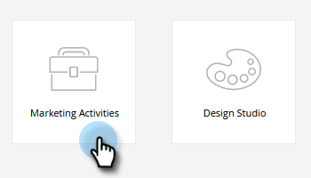
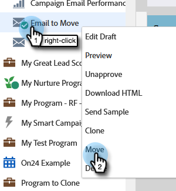
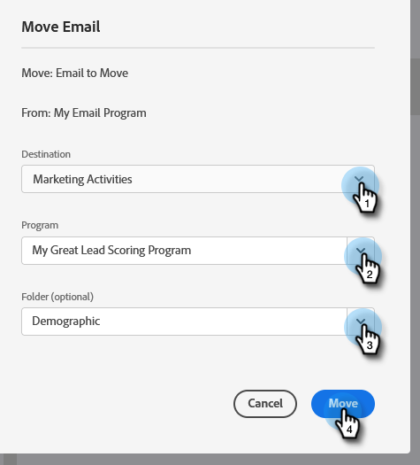
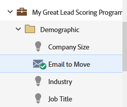

# Move an Email {#move-an-email}

Need to move an email from one program to another? Here's how.

1. Go to **[!UICONTROL Marketing Activities]**.

   

1. Locate the email you want to move, right-click on it and select **[!UICONTROL Move]**.

   

1. Select the **[!UICONTROL Destination]**, **[!UICONTROL Program]**, and optional **[!UICONTROL Folder]**. Select **[!UICONTROL Move]**.

   

   >[!NOTE]
   >
   >In this example we're moving an email to another program, but you can also move an email to a folder in the [!UICONTROL Design Studio].

   You'll see your email now lives in the other program.

   

   >[!NOTE]
   >
   >You can also simply drag-and-drop your email to a new destination within the tree.
