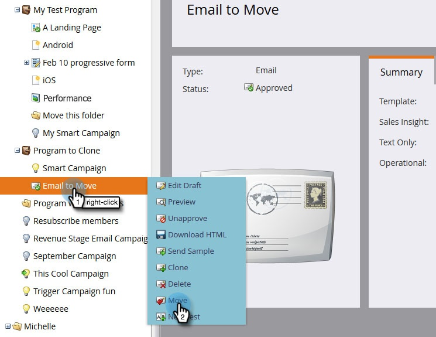
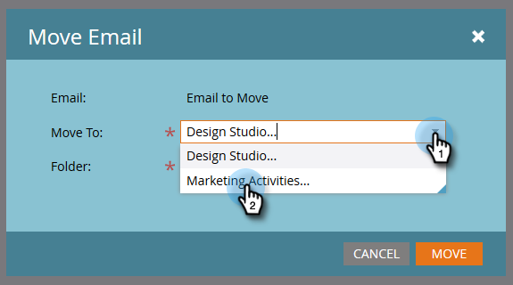
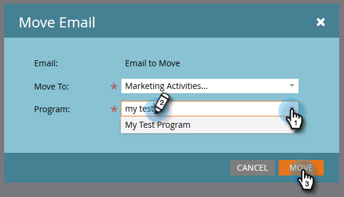
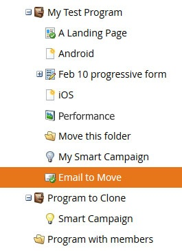

# Move an Email {#move-an-email}

Need to move an email from one program to another? Here's how.

1. Go to **Marketing Activities**.

   

1. Locate the email you want to move, right-click on it, and select **Move**.

   

1. Click the **Move To** drop-down and select **Marketing Activities**.

   

   >[!NOTE]
   >
   >In this example we're moving an email to another program, but you can also move an email to a folder in the Design Studio.

1. Click the **Program** drop-down, find and select the destination program, and click **Move**.

   

   You'll see your email now lives in the other program.

   

   Pretty nifty!

