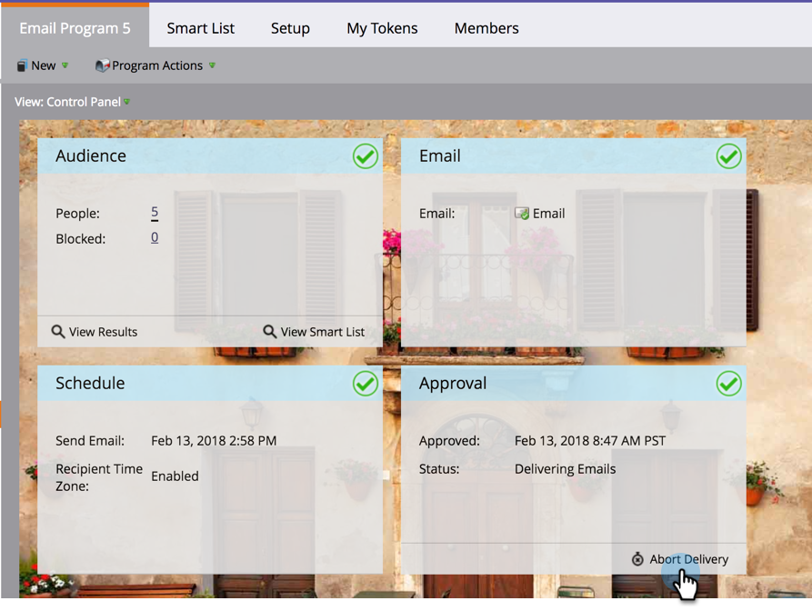
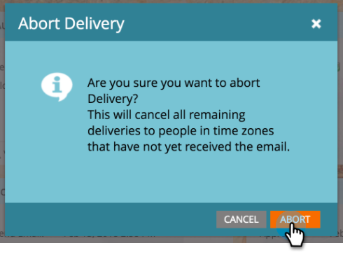
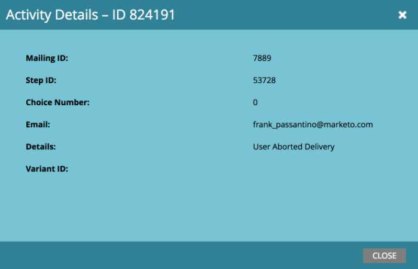

# Abort Delivery of Email Programs Scheduled with Recipient Time Zone {#abort-delivery-of-email-programs-scheduled-with-recipient-time-zone}

In emergency cases, you can abort the delivery of an email program that has already started running with Recipient Time Zone enabled.

Since email programs scheduled with Recipient Time Zone can run for up to 24 hours, aborting the delivery of the program will cancel any subsequent sends after that point.

1. Select the email program you want to cancel, then click **[!UICONTROL Abort Delivery]** under the [!UICONTROL Approval] tile in the control panel.

   

1. Confirm that you want to cancel the delivery by clicking **[!UICONTROL Abort]**.

   

1. After cancellation, the **[!UICONTROL Results]** grid of your email program will look something like the one below. Any subsequent sends are canceled and will show up as "Email Bounced Soft" in the **[!UICONTROL Activity Type]** column.

   

   >[!NOTE]
   >
   >Canceled emails will **not** show up as a soft bounce *until* the time they were originally scheduled to be delivered in their respective time zones. Up until that point, they will still display as "Send Email."

1. From the grid, you can click any email to view activity details. For a canceled send, the details pop-up will look like this:

   

>[!MORELIKETHIS]
>
>* [Understanding Recipient Time Zone](/help/marketo/product-docs/email-marketing/email-programs/email-program-actions/scheduling-with-recipient-time-zone/understanding-recipient-time-zone.md)
>* [Schedule Email Programs with Recipient Time Zone](/help/marketo/product-docs/email-marketing/email-programs/email-program-actions/scheduling-with-recipient-time-zone/schedule-email-programs-with-recipient-time-zone.md)
