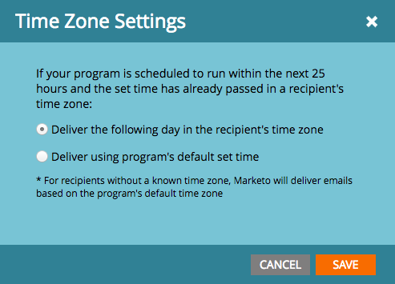
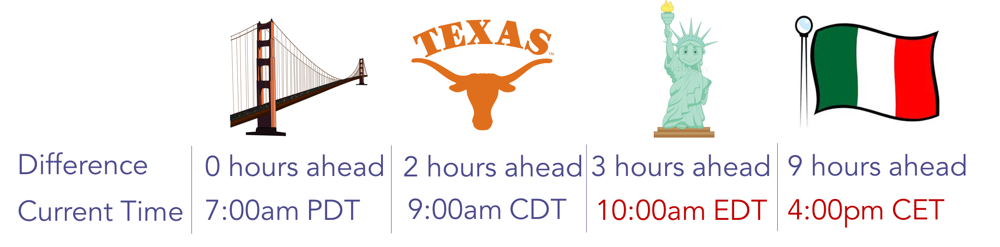
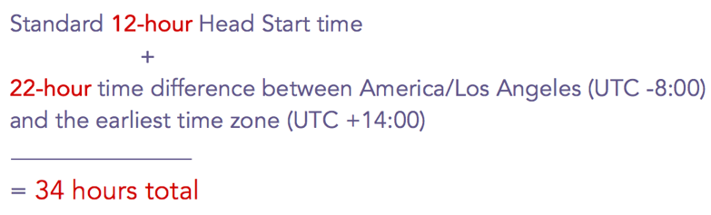

# Schedule Email Programs with Recipient Time Zone {#schedule-email-programs-with-recipient-time-zone}

There are two potential scenarios when scheduling an email program while Recipient Time Zone is enabled:

1. Scheduling the program to run **within** the next 25 hours
1. Scheduling the program to run **more** than 25 hours in the future (i.e., next week)

## Scenario 1: Within 25 Hours {#scenario-within-hours}

Let's say you approve an email program with Recipient Time Zone enabled and a scheduled delivery time within the next 25 hours. You may have people in your smart list who live in time zones where the scheduled time has already passed.

In this scenario, we allow you to decide what to do with this subset of qualified people. Click the gear icon next to **Recipient Time Zone** in the **Schedule** tile of the email program.

This gives you two options:

>[!NOTE]
>
>**Definition**
>
>* **Deliver the following day in recipient’s time zone**: if the email is scheduled to go out on Tuesday at 9:00am, qualified people who live in time zones where the scheduled time has already passed will receive the email on *Wednesday* at 9:00am.
>
>* **Deliver using the program's default set time**: if the email is scheduled to go out on Tuesday at 9:00am, qualified people who live in time zones where the scheduled time has already passed will receive the email *based on your subscription time zone settings*. So, if your [s](../../../../../product-docs/administration/settings/select-your-language-locale-and-time-zone.md) [ubscription time zone settings](../../../../../product-docs/administration/settings/set-default-location-settings-for-a-subscription.md) are set to PDT America/Los Angeles, these recipients will still receive the email on Tuesday at 9:00am PDT (whatever time that may be in their own time zones).
>

>[!NOTE]
>
>[Learn more](https://docs.marketo.com/display/DOCS/Understanding+Recipient+Time+Zone#UnderstandingRecipientTimeZone-CalculatingTimeZone) about how Marketo calculates time zones for recipients.

Let's consider this scenario in more detail. Say you're in San Francisco, scheduling an email at 7:00am for a **9:00am** send. In your smart list, there are people from the following regions:

* San Francisco
* Texas
* New York
* Italy

9:00am has already passed in New York and Italy, so qualified people in these two time zones will receive the email based on the **Time Zone Settings**:

* **Deliver the following day in recipient’s time zone:** Wednesday at 9:00am in their respective time zones, **OR**

* **Deliver using the program's default set time**: Tuesday at 9:00am PDT (New York - 12:00pm EDT and Italy - 6:00pm CET).

Once you approve your program, it starts running within 15 minutes.

>[!NOTE]
>
>Although the program will start the *process* of sending emails in 15 minutes, emails won't be *delivered* at that time. Recipients will still receive emails based on the **Time Zone Settings** you choose.

## Scenario 2: More than 25 Hours {#scenario-more-than-hours}

In this second scenario, you approve an email program with **Recipient Time Zone** enabled and a scheduled delivery time that's more than 25 hours in the future. In this case, the program will start running at the scheduled time in the **earliest** time zone in the world (UTC + 14:00). There may be people who qualify for your smart list in every time zone across the globe, so starting in the earliest time zone allows us to deliver the email at the scheduled date/time to all recipients in their respective time zones.

Head Start

Now, let's talk about how [Head Start](../../../../../product-docs/email-marketing/email-programs/email-program-actions/head-start-for-email-programs.md) works with **Recipient Time Zone**. Our existing Head Start feature requires the program to be scheduled at least 12 hours in advance. So what does that mean for Recipient Time Zone? Recall that when Recipient Time Zone is enabled, we start running the email program at the scheduled time in the earliest time zone (UTC +14:00). So, to enable **both** Head Start and Recipient Time Zone, email programs need to be scheduled **at least 12 hours ahead of the scheduled time in UTC +14:00.**

This means that if you're in America/Los Angeles and want to enable both Head Start and Recipient Time Zone, you need to schedule the program **34 hours** in advance. How did we get to this number?

 &nbsp;

In short, email programs scheduled with Recipient Time Zone need to start running at the scheduled time in the earliest time zone (i.e., where it reaches midnight first) in order to accommodate every time zone. So, if you schedule an email program...

* **with a delivery time *within* 25 hours**, the program starts running within 15 minutes. Recipients who have already passed the scheduled time will receive the email based on the time zone settings you've chosen.
* **with a delivery time *more* *than* 25 hours in the future**, the program starts running at the scheduled time in the earliest time zone (UTC +14:00).
* **with Head Start**, the program starts processing 12 hours prior to the scheduled time in the earliest time zone (UTC +14:00).

>[!CAUTION]
>
>Anyone who unsubscribes between the time you start your email send and when it's actually delivered will still receive the email. We recommend adjusting your unsubscribe notification to reflect that unsubscribes may take 1-2 business days to process.

>[!MORELIKETHIS]
>
>* [Understanding Recipient Time Zone](understanding-recipient-time-zone.md)
>* [Head Start for Email Programs](../../../../../product-docs/email-marketing/email-programs/email-program-actions/head-start-for-email-programs.md)
>* [Abort Delivery of Email Programs Scheduled with Recipient Time Zone](abort-delivery-of-email-programs-scheduled-with-recipient-time-zone.md)
>

