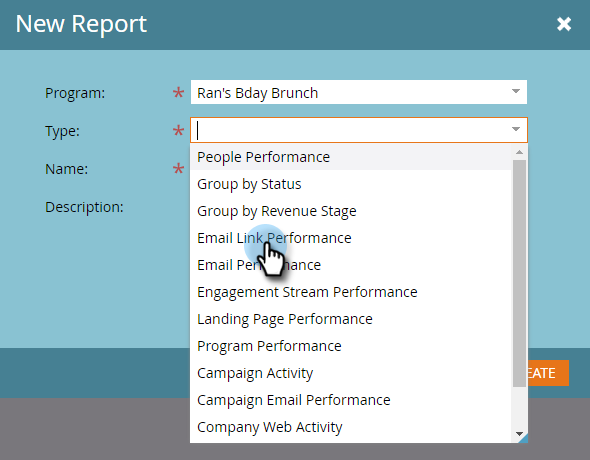
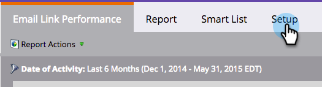
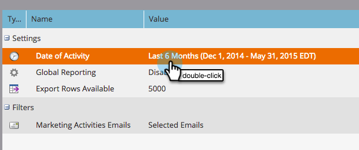
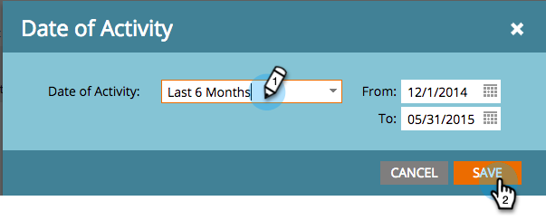
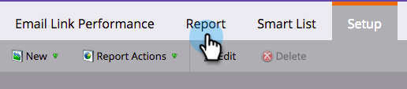
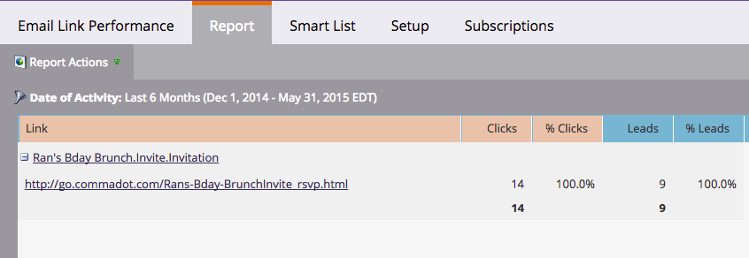

# Email Link Performance Report {#email-link-performance-report}

Create an Email Link Performance report to see how well the links in your emails are performing.

1. [Create a report in a program](/help/marketo/product-docs/reporting/basic-reporting/creating-reports/create-a-report-in-a-program.md) and select **Email Link Performance** as the report type.

   

1. Click **Setup**.

   

1. Double-click on **Date of Activity** under **Settings**.

   

1. Set an appropriate time frame for your report. Click **Save**.

   

1. Click **Report**.

   

1. Great! Now you've created an Email Link Performance report.

   

[Columns available](/help/marketo/product-docs/reporting/basic-reporting/editing-reports/select-report-columns.md) for an Email Link Performance report include:

<table> 
 <thead> 
  <tr> 
   <th colspan="1" rowspan="1">Column</th> 
   <th colspan="1" rowspan="1">Description</th> 
  </tr> 
 </thead> 
 <tbody> 
  <tr> 
   <td colspan="1" rowspan="1">Link</td> 
   <td colspan="1" rowspan="1">Grouped by email name. Click the plus (+) to see all links included that email.</td> 
  </tr> 
  <tr> 
   <td colspan="1" rowspan="1">Clicks</td> 
   <td colspan="1" rowspan="1">The number of times that link was clicked.</td> 
  </tr> 
  <tr> 
   <td colspan="1" rowspan="1">% Clicks</td> 
   <td colspan="1" rowspan="1">Of the total clicks on all links in that email, percentage on this link.</td> 
  </tr> 
  <tr> 
   <td colspan="1" rowspan="1">People</td> 
   <td colspan="1" rowspan="1">The number of unique people who clicked the link.</td> 
  </tr> 
  <tr> 
   <td colspan="1" rowspan="1">% People</td> 
   <td colspan="1" rowspan="1">Of the total unique people who clicked links in that email, percentage on this link.</td> 
  </tr> 
 </tbody> 
</table>

>[!NOTE]
>
>This report will show "malformed link" when invalid/empty links are added to emails. If you see this message, [check the HTML source](/help/marketo/product-docs/email-marketing/general/functions-in-the-editor/edit-an-emails-html.md) in the email editor for empty links or tokens that do not populate a full link.

>[!TIP]
>
>If you want to know exactly what an individual person did, you can open up the [Activity Log](/help/marketo/product-docs/core-marketo-concepts/smart-lists-and-static-lists/managing-people-in-smart-lists/filter-activity-types-in-the-activity-log-of-a-person.md) in the [Person Detail](/help/marketo/product-docs/core-marketo-concepts/smart-lists-and-static-lists/managing-people-in-smart-lists/using-the-person-detail-page.md) page from the Members tab in the program.

>[!MORELIKETHIS]
>
>* [Email Performance Report](/help/marketo/product-docs/email-marketing/email-programs/email-program-data/email-performance-report.md)
>* [Filter Assets in an Email Report](/help/marketo/product-docs/reporting/basic-reporting/report-activity/filter-assets-in-an-email-report.md)
