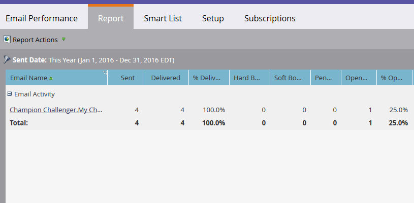

# Email Performance Report {#email-performance-report}

To see how well your emails are performing with stats like delivered, opened, clicked, etc., create an Email Performance Report.

1. [Create a Report in a Program](/help/marketo/product-docs/reporting/basic-reporting/creating-reports/create-a-report-in-a-program.md) and select the **Email Performance** [Report Type](/help/marketo/product-docs/reporting/basic-reporting/report-types/report-type-overview.md).
1. [Change the Report Time Frame](/help/marketo/product-docs/reporting/basic-reporting/editing-reports/change-a-report-time-frame.md) and click the **Report** tab.
1. You're there! Now explore the report to see how your email(s) performed.

   >[!NOTE]
   >
   >The Sent Date filter is based on the first date that the email was sent.

   

   >[!TIP]
   >
   >Click the name of an email to open it in the Email Previewer.

   >[!NOTE]
   >
   >An email performance report includes activities for all people, including those that have been deleted since the email was sent. Sometimes, you want to see activities only for active people. In that case, you need to filter deleted people out of your report. Use the **Smart List** tab to [create a smart list](/help/marketo/product-docs/core-marketo-concepts/smart-lists-and-static-lists/creating-a-smart-list/create-a-smart-list.md) for the report. If you aren't filtering on any specific field, set the Email Address filter to: **is not empty**.

   [Select Report Columns](/help/marketo/product-docs/reporting/basic-reporting/editing-reports/select-report-columns.md) for an Email Performance report include:

   | Column |Description |
   |---|---|
   | Hard Bounced |Email was rejected because of a permanent condition, such as nonexistent email address. |
   | Soft Bounced |Email was rejected because of a temporary condition, such as a server being down or a full inbox. |
   | Pending |This number is calculated by subtracting the number of emails Delivered, Bounced, and Soft Bounced from the total number Sent. |
   | Clicked Link |Number of email recipients who clicked a link in the email. |
   | Unsubscribed |Number of email recipients who clicked the **Unsubscribe** link in the email and filled out the form. |

   >[!NOTE]
   >
   >Unsubscribe links and email addresses being clicked in an email won't register under Clicked Links in the report.

In general, we try to use common sense to record these statistics. For example, if someone clicked a link in an email, they obviously opened the email first. We follow these specific rules for the Email Performance Report:

* **Rule 1**: Each email activity record is set to one, and only one, of the following: _Delivered_, _Hard Bounced_, _Soft Bounced_, or _Pending_.

* **Rule 2**: If the email record shows *Opened*, it is counted as *Delivered*.

* **Rule 3**: If the email record shows _Clicked Email_ or _Unsubscribed_, it is counted as _Delivered_ and _Opened_.

* **Rule 4**: If the email is _Opened_, bounces are ignored. If the email has not been opened, _Hard Bounced_ takes precedence over _Soft Bounced_ and _Delivered_.

>[!NOTE]
>
>Multiple sends from the same campaign to the same person are counted only once.

>[!MORELIKETHIS]
>
>* [Filter Assets in Campaign Email Reports](/help/marketo/product-docs/reporting/basic-reporting/report-activity/filter-assets-in-a-campaign-email-reports.md)
>* [Email Link Performance Report](/help/marketo/product-docs/email-marketing/email-programs/email-program-data/email-link-performance-report.md)
