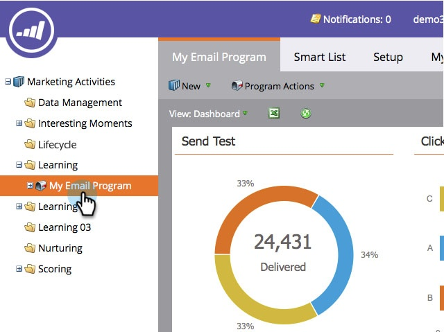
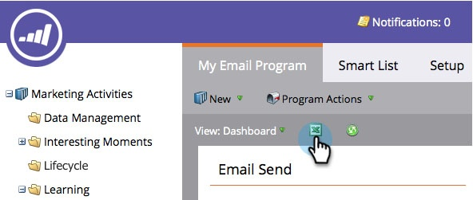

# Export Email Program Dashboard to Excel {#export-email-program-dashboard-to-excel}

Once you've run an email program and have some data in the dashboard, you can export that raw data to excel for further analysis. Here's how.

1. Go to **[!UICONTROL Marketing Activities]**.

   

1. Find and select your email program.

   

   >[!NOTE]
   >
   >If your email program hasn't started yet, you will not see a dashboard because there is no data to see.

1. Simply click the Excel icon and your export will begin.

   

   Pretty easy, right?
