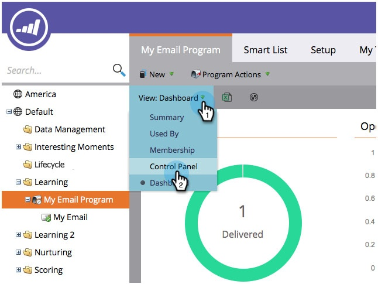
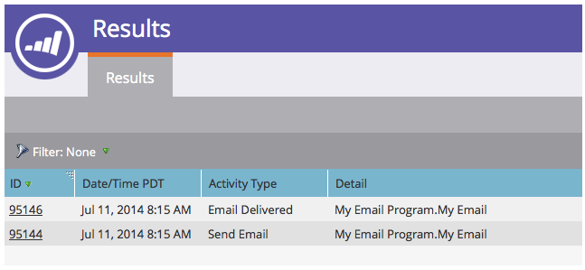

# View Email Program Results {#view-email-program-results}

Just like the Results tab in smart campaigns, you can see the same information in email programs.

1. Go to **Marketing Activities**.

   

1. Find and select your email program.

   

   >[!NOTE]
   >
   >If the email program has already run, you will be taken directly to the email program dashboard.

1. Under **View**, select **Control Panel**.

   

1. Under the **Audience** tile, click **View Results**.

   

   There you have it!

   
