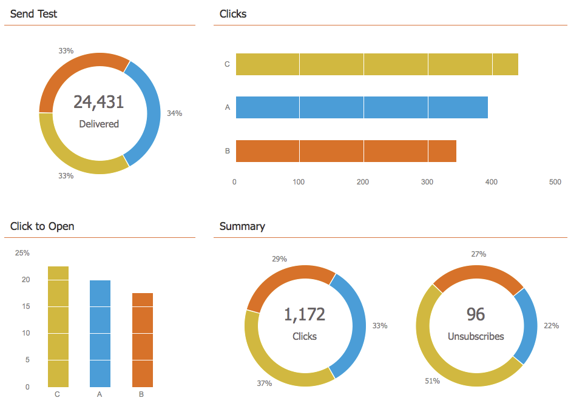
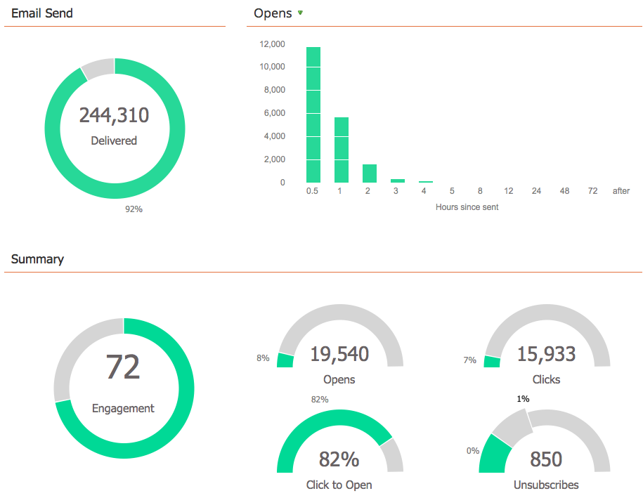

# View the Email Program Dashboard {#view-the-email-program-dashboard}

Check out how your email program (with or without an A/B test) is performing with this dashboard.

## Select your Email Program {#select-your-email-program}

1. Go to **Marketing Activities**.

   

1. Find and select your email program.

   

   >[!CAUTION]
   >
   >If your A/B test or email program has not started yet, you will not see a dashboard.

## Email Program A/B Test View {#email-program-a-b-test-view}

   If you added an A/B test to your email program and the test is currently running, you will see the following:

   

## Email Program View {#email-program-view}

   Alternatively, if you did not add an A/B test *or* if the test is over, the following should be displayed:

   

   >[!TIP]
   >
   >Experiment by hovering your cursor over the chart widgets. It will show you additional information.

>[!NOTE]
>
>**Related Articles**
>
>* [Use the Email Program Dashboard - A/B Test View](../../../../product-docs/email-marketing/email-programs/email-program-actions/email-test-a-b-test/use-the-email-program-dashboard-a-b-test-view.md)
>* [Use the Email Program Dashboard](use-the-email-program-dashboard.md)
>

