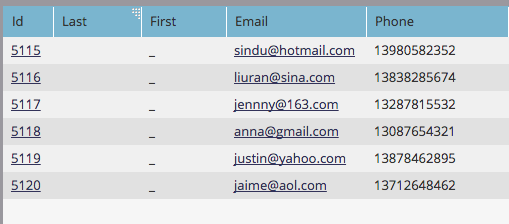
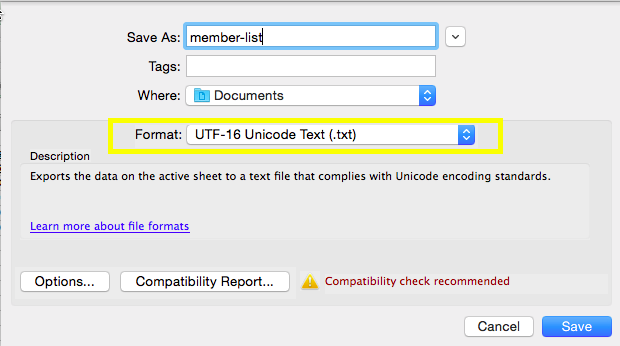
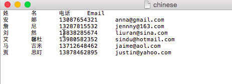
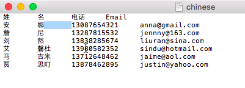
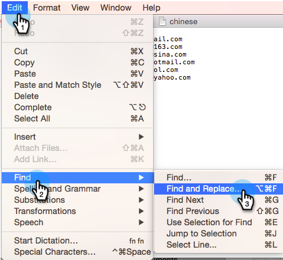
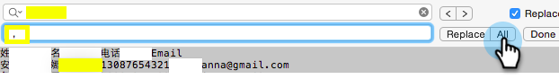
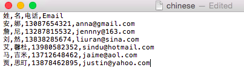

# Import a Non-Latin Characters List {#import-a-non-latin-characters-list}

Trying to import a file that's not in English? The list looks perfect when you open it up with Excel.

But when you import it into Marketo, you might see that the non-English characters aren't picked up correctly.

This is because the file is not saved properly for Marketo to recognize all the non-Latin characters. The good news is, there are a few simple steps you can follow to fix it.

1. Select **Save As...** from the **File** menu in Excel.

   

1. Choose **UTF-16 Unicode Text (.txt)** as the **Format** option. This will encode the file the way Marketo can display them.

   

   >[!NOTE]
   >
   >Marketo also supports UTF-8, Shift-JIS, or EUC-JP.

1. Excel will save the new file as a Text File with a .txt extension. But it also converts all the commas in the file into tabs. We need to change it back.

   >[!TIP]
   >
   >You can open the Text File using **Notepad** if you are using Windows or **TextEdit** if you are using a Mac.

   

1. Select a tab from the document and copy it.

   

1. Select **Find and Replace...** from the **Edit** menu.

   

   >[!TIP]
   >
   >The equivalent action for Windows users is: **Edit > Replace...**

1. Paste the tab you copied in step 4 into the first (to be replaced) box, and type in a comma in the second (replace with) box. And click **All**.

   

1. And voila, all the commas are back and we are ready to roll.

   

1. Import the new file into Marketo, and the information should be displayed correctly this time.

   

   >[!NOTE]
   >
   >Any date/time fields being imported are treated as Central Time. If you have date/time fields in a different time zone, you can use an Excel formula to transform it to Central Time (America/Chicago).

We know this is weird, but it works. Happy Importing!
