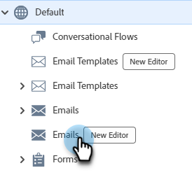

# Create an Email {#create-an-email}

Intro text here.

1. Log in to the [Adobe Experience Cloud](https://experiencecloud.adobe.com/).

   SCREENSHOT???

LIST EVERY STEP UNTIL YOU GET TO MARKETO???

1. In My Marketo, select **Design Studio**.

   

1. In the tree, select **Emails (New Editor)**.

   

1. Click the **Create email** button.

   

1. Enter an email name and a subject line. Click **Create**.

   

Your email is created. Now it's time to design it. LINK
