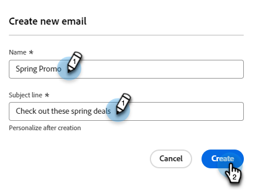

# Email authoring {#email-authoring}

Learn how to create, personalize, and preview emails in the new Marketo Engage Email Designer.

>[!IMPORTANT]
>
>This article is only for members of the New Marketo Engage Email Editor beta. Please do not disseminate.

## Create an email {#create-an-email}

1. Log in to Marketo Engage via the [Adobe Experience Cloud](https://experiencecloud.adobe.com/){target="_blank"}.

1. In My Marketo, select **Design Studio**.

   

1. In the tree, select **Emails (New Editor)**.

   

1. Click the **Create email** button.

   

1. Enter an email name and a subject line. Click **Create**.

   

That's it. Now it's time to design your email.

## Choose your content type {#choose-your-content-type}

1. In the email you just created, click **Add email content**.

   

1. The _Create your email_ page loads. You can choose from a few options:

* [Design from scratch](#design-from-scratch) using the visual email editor

* [Import your own HTML](#import-html) via an HTML or zip file

* [Select an existing template](#choose-a-template) (one of our samples or one you already saved)

### Design from scratch {#design-from-scratch}

When starting from scratch in the email editor, use the options below to define your content.

1. In the _Create your email_ page, select **Design from scratch**.

1. Add [structure and content](#add-structure-and-content) to your email.

1. Add [images](#add-assets).

1. [Personalize](#personalize-content) your content.

1. Review links and [edit tracking](#edit-url-tracking).

### Import HTML {#import-html}

You can import existing HTML content to design your email. The content can be:

* An HTML file with an incorporated style sheet

* A .zip file that includes an HTML file, the style sheet (.css) and images

>[!NOTE]
>
>There are no constraints on the .zip file structure. However, references must be relative and fit with the tree structure of the .zip folder.

1. In the Design your template page, select **Import HTML**.

1. Drag and drop the desired HTML or .zip file (or select a file from your computer) and click **Import**.

   

>[!NOTE]
>
>When the HTML content is uploaded, your content will be in Compatibility mode. In this mode, you can only personalize your text, add links, or add assets to your content.

You can make desired changes to the imported content using the [visual email editor tools](#add-structure-and-content).

### Choose a template {#choose-a-template}

There are two types of templates to choose from.

* **Sample templates**: Marketo Engage offers four out-of-the-box email templates.

* **Saved templates**: These are templates you created from scratch using the Templates menu, or an email you created and chose to save as a template.

>[!BEGINTABS]

>[!TAB Sample templates]

Choose one of the out-of-the-box templates for a head start on your email template design.

1. The Sample templates tab is open by default.

1. Select the template you want to use.

   

1. Click **Use this template**.

   

1. Edit the content as desired using the visual content designer.

>[!TAB Saved templates]

1. Click the **Saved templates** tab and select the desired template.

   

1. Click **Use this template**.

   

1. Edit the content as desired using the visual content designer.

>[!ENDTABS]

## Add structure and content {#add-structure-and-content}

1. To start creating or modifying content, drag and drop an item from Structures onto the canvas. Edit its settings in the pane on the right.

   >[!TIP]
   >
   >Select the n:n column component to define the number of columns of your choice (between three and 10). You can also define the width of each column by moving the arrows below the column.

   

   >[!NOTE]
   >
   >Each column size cannot be less than 10% of the total width of the structure component. Only empty columns can be removed.

1. From the Contents section, drag over desired items and drop them into one or more structure components.

   

1. Each component can be customized via the Settings or Style tabs. Change the font, text style, margin, and more.

### Add Assets {#add-assets}

```
ADD ASSETS OR ADD IMAGES? WHAT OTHER ASSETS CAN YOU ADD?
```

```
Access assets stored in the Assets library. IMAGES AND FILES ONLY?
```

1. To access your images, click the Asset selector icon.

   SCREENSHOT

1. Drag and drop the desired image into a structure component.

   SCREENSHOT

   >[!NOTE]
   >
   >To replace an existing image, select it, then click **Select an asset** in the Settings tab on the right.

Click Enable condition content to add dynamic content and adapt the content to the targeted profiles based on conditional rules.


If needed, you can further personalize your email by clicking Switch to code editor from the advanced menu. This allows you to edit the email source code, for example to add tracking or custom HTML tags.

CAUTION
You cannot revert back to the visual designer for this email after switching to the code editor.

Once your content is ready, click the Simulate content button to check rendering. You can choose the desktop or mobile view.

When ready, click Save

### Layers, settings, and styles {#layers-settings-styles}

```
ARE THEY CALLED LAYERS OR COMPONENTS
```

Open the navigation tree to access specific structures and their columns/components for more granular editing. To access, click the Navigation tree icon.

   

The example below outlines steps to adjust padding and vertical alignment inside a structure component composed of columns.

1. Select the column in the structure component directly in the canvas or using the _Navigation tree_ displayed at the left.

1. From the column toolbar, click the _[!UICONTROL Select a column]_ tool and choose the one that you want to edit.

   You can also select it from the structure tree. The editable parameters for that column are displayed in the _[!UICONTROL Settings]_ and _[!UICONTROL Styles]_ tabs on the right.

   

1. To edit the column properties, click the _[!UICONTROL Styles]_ tab on the right and change them according to your needs:

   * For **[!UICONTROL Background]**, change the background color as needed.

      Clear the check box for a transparent background. Enable the **[!UICONTROL Background image]** setting to use an image as the background instead of a solid color.

   * For **[!UICONTROL Alignment]**, select the _Top_, _Middle_, or _Bottom_ icon.
   * For **[!UICONTROL Padding]**, define the padding for all sides.

      Select **[!UICONTROL Different padding for each side]** if you want to adjust the padding. Click the _Lock_ icon to break synchronization.

   * Expand the **[!UICONTROL Advanced]** section to define inline styles for the column.

   

1. Repeat these steps as needed to adjust the alignment and padding for the other columns in the component.

1. Save your changes.

### Personalize content {#personalize-content}

Tokens work in the new editor the same way they work in the old, but the icon looks different. The example below outlines adding a first name token with fallback text.

1. Select the text component. Place the cursor where you want the token to appear and click the **Add personalization** icon.

   

1. Click the desired [token type](/help/marketo/product-docs/demand-generation/landing-pages/personalizing-landing-pages/tokens-overview.md){target="_blank"}.

   

1. Find the desired token and click the **...** icon (clicking the + icon instead adds a token with no fallback text).

   

   >[!NOTE]
   >
   >"Fallback text" is the new editor term for default value. Example: ``{{lead.First Name:default=Friend}}``. It is recommended in case there is no value for the person in the field you choose.

1. Set your fallback text and click **Add**.

   

1. Click **Save**.

### Edit URL tracking {#edit-url-tracking}

Sometimes you don't want to enable the Marketo Tracking URL on a link in an email. This is useful when the destination page does not support URL parameters and may result in a broken link.

1. Click the Links icon to display all URLs in your email.

   

1. Click the pencil icon to edit tracking for any desired links.

1. Click the **Tracking Type** drop-down and make your selection.

   

   ```
   LABEL?

   TAGS?
   ```

   <table><tbody>
     <tr>
       <td><b>Track without mkt_tok</b></td>
       <td>definition</td>
     </tr>
     <tr>
       <td><b>Track with mkt_tok</b></td>
       <td>definition</td>
     </tr>
     <tr>
       <td><b>Do not track</b></td>
       <td>definition</td>
     </tr>
   </tbody>
   </table>

1. Click **Save** when done.

## Check Alerts {#check-alerts}

As you design your content, alerts are displayed on the top-right of the screen when key settings are missing.

There are two types of alerts:

**Warnings**

Warnings refer to recommendations and best practices, such as:

* **The opt-out link is not present in the email body**: While unsubscribe links are a requirement, adding them to the body of your email is a best practice.

>[!NOTE]
>
>Adding an unsubscribe option is not required for [Operational Emails](/help/marketo/product-docs/email-marketing/general/functions-in-the-editor/make-an-email-operational.md) (non-marketing).

* **Text version of HTML is empty**: You must define a text version of your email body for when HTML content cannot be displayed.

* **Empty link is present in email body**: Verify all links in your email are correct.

* **Email size has exceeded the limit of 100KB**: For optimal delivery, make sure the size of your email does not exceed 100KB.

**Errors**

Errors prevent you from sending or testing the email until they are resolved:

* **Subject line is missing**: An email subject line is required.

* **Email version of the message is empty**: This error occurs when the email content has not been configured.

## Test your email {#test-your-email}

When your message content is defined, you can use test profiles to preview it, send proofs, and control how it renders in popular desktop, mobile, and web-based clients. If you inserted personalized content, you can check how it's displayed in the message using test profile data.

To preview your email content, click **Simulate content**, then add a test profile to check your message using the test profile data.

   

## Reference an email {#reference-an-email}

After you've created an email in the new editor, you can reference it in Smart Campaigns and/or Smart Lists like you would with any other email.

* Reference it in a Smart List by [following the usual steps](/help/marketo/product-docs/core-marketo-concepts/smart-lists-and-static-lists/creating-a-smart-list/create-a-smart-list.md).

* Reference it in a Smart Campaign by [following the usual steps](/help/marketo/product-docs/core-marketo-concepts/smart-campaigns/creating-a-smart-campaign/create-a-new-smart-campaign.md).

>[!NOTE]
>
>Only saved emails can be referenced. There is no "approved" status in the new email editor.

>[!MORELIKETHIS]
>
>[Email templates](/help/marketo/product-docs/email-marketing/general/beta-new-email-editor/email-templates.md){target="_blank"}: Learn how to create, design, and access an email template in the new editor.
