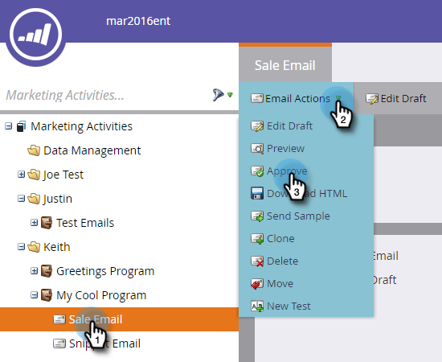
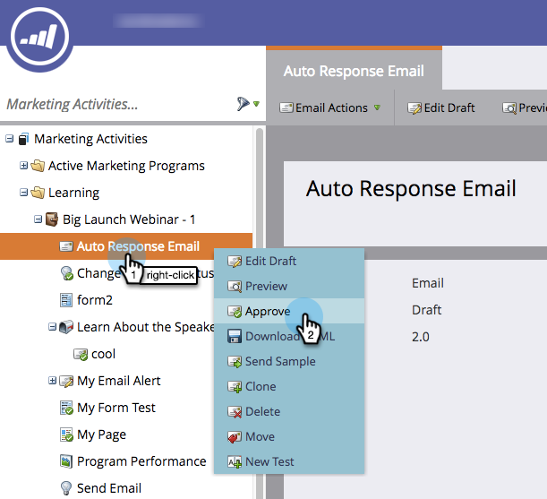

# Approve an Email {#approve-an-email}

Emails start in draft state. They are generally unavailable in the system until you approve them. There are a few ways to approve an email.

## Approve It Using the Email Actions Menu {#approve-it-using-the-email-actions-menu}

1. Find and select your email, click the **Email Actions** drop-down and select **Approve**.

   

## Approve It Directly in the Tree {#approve-it-directly-in-the-tree}

1. Find and select your email, right-click on it and select **Approve**.

   

## Approve Your Email in the Email Editor {#approve-your-email-in-the-email-editor}

1. In your email, click the **Email Actions** drop-down and select **Approve and Close**.

   

After it's approved, your email's ready for use!
