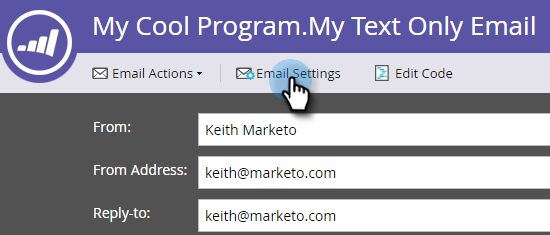
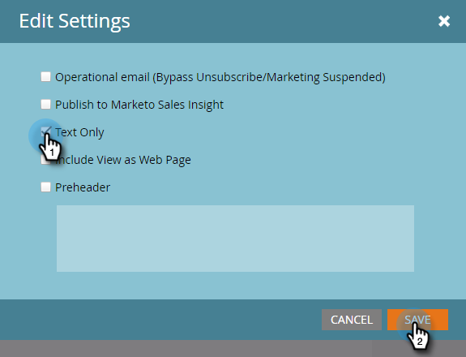
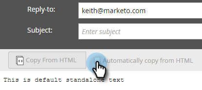

# Create a Text Only Email {#create-a-text-only-email}

If you ever want to send text only emails, here's how to create an email that will go out without any HTML content.

>[!NOTE]
>
>Because opens are tracked by the recipient downloading the email's images (which includes an invisible tracking pixel), opens are **not** able to be tracked for Text Only emails.

1. Go to the **Marketing Activities** area.

   

1. Select your program, click the **New** drop-down and select **New Local Asset**.

   

1. Select **Email**.

   

1. Enter a **Name**, select a template and click **Create**.

   

1. In the email editor, click **Email Settings**.

   

1. Check **Text Only** and click **Save**.

   

   >[!CAUTION]
   >
   >Links are not automatically tracked in text only emails. See how to  [Add Tracked Links to a Text Email](../../../../product-docs/email-marketing/general/functions-in-the-editor/add-tracked-links-to-a-text-email.md).

   >[!TIP]
   >
   >You can also edit an existing email and change this setting. Don't forget to approve the draft.

1. Uncheck the **Automatically copy from HTML** checkbox.

   

   >[!NOTE]
   >
   >Any content added to the HTML section of the email will be ignored when it's sent.

1. Double-click the text area.

   

1. Edit your text and click **Save**.

   

It's as easy as that.
