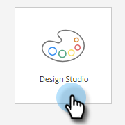
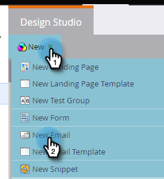
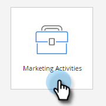
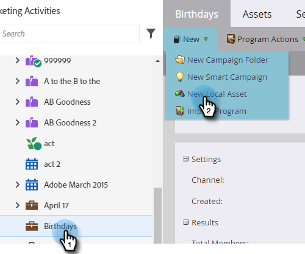
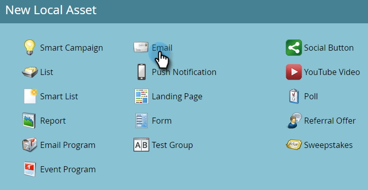
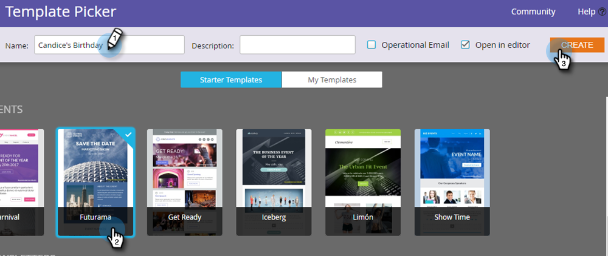
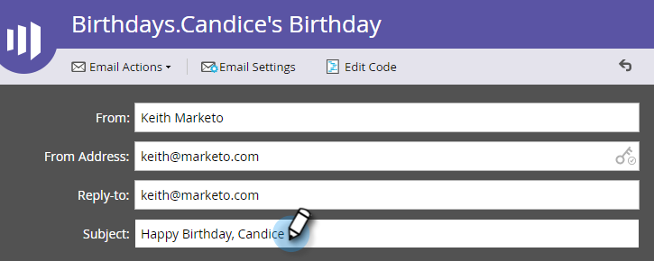

# Create an Email {#create-an-email}

There are two main ways to create an email in Marketo. Let's look at both.

## Create an Email in the Design Studio {#create-an-email-in-the-design-studio}

1. Go to the **Design Studio**.

   

1. Click the **New** drop-down and select **New Email**.

   

   >[!NOTE]
   >
   >When you create an email in the Design Studio, it can be found in the tree under "Emails."

Simple! Now for the other way...

## Create an Email in Marketing Activities {#create-an-email-in-marketing-activities}

1. Go to **Marketing Activities**.

   

1. Select the program you want to add the email to, click the **New** drop-down and select **New Local Asset**.

   

1. Click **Email**.

   

   And that's it!

Whichever method you choose brings you to the template picker.

1. Give your email a name, click on the template you want to use, then click **Create**.

   

   >[!NOTE]
   >
   >You can choose from a collection of ready-to-go responsive email templates, or a template you saved by first selecting **My Templates**, and following the same steps.

1. Enter a subject line. The recommended character limit is 50.

   

   Depending on the template you've chosen, you'll have different options in which to edit your email. For emails with modules, check out [Add Modules to your Email](/help/marketo/product-docs/email-marketing/general/email-editor-2/add-modules-to-your-email.md).

Your email is now created, so edit away!

>[!MORELIKETHIS]
>
>[Edit Your Email Header](/help/marketo/product-docs/email-marketing/general/creating-an-email/edit-your-email-header.md)
