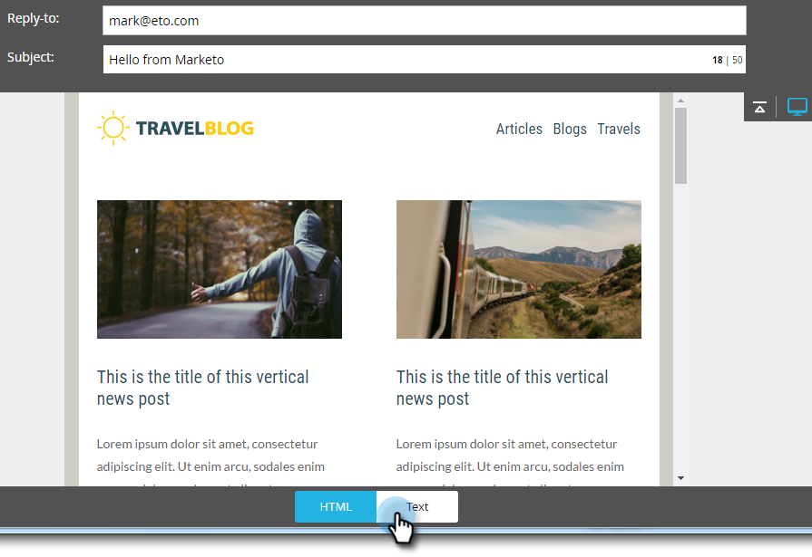
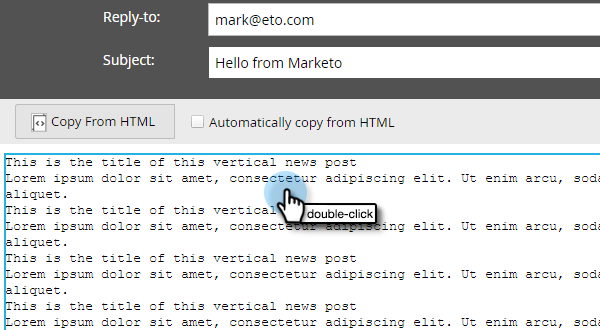
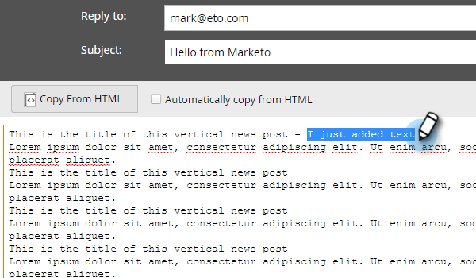
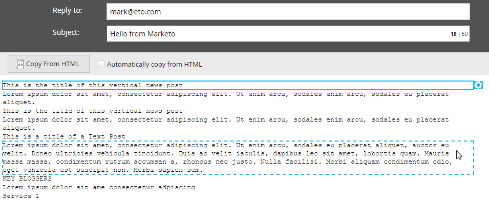

# Edit the Text Version of an Email {#edit-the-text-version-of-an-email}

When you create an email, you may want its text version to be worded differently than the HTML version. By default, Marketo automatically copies the text content of any rich text element that's in your email over to the Text version. Here's how to edit it.

>[!NOTE]
>
>This is not an article on creating a text-only email. For information on that, see [Create a Text-Only Email](/help/marketo/product-docs/email-marketing/general/creating-an-email/create-a-text-only-email.md).

1. In the email editor, click the **Text** tab at the bottom of the email.

   

1. Uncheck **Automatically copy from HTML** to make changes.

   

1. Double-click the text area.

   

1. Make your edits. After you're done simply close the editor, or go back to the HTML version. The changes will auto-save.

   

   If you only have static content, text will be editable in one big block (seen in Step 3). If you have dynamic content, the text will be broken up into different editable sections, as seen below.

   

Now you know!
