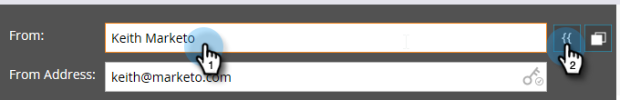
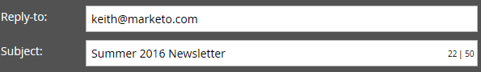
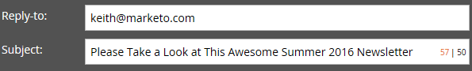

# Edit Your Email Header {#edit-your-email-header}

The email header in Marketo is fully customizable. It consists of four fields:

* **[!UICONTROL From]** - The name of the sender as you want it to appear
* **[!UICONTROL From Address]** - The email address of the sender as you want it to appear
* **[!UICONTROL Reply-to]** - The email address you want a person's reply to be sent to (can be different than [!UICONTROL From Address])
* **[!UICONTROL Subject]** - The email's subject line

To edit these values, click in each field and enter your information.

>[!TIP]
>
>To set a default From Name and From Email, see [Change the Default From Email and From Label](/help/marketo/product-docs/administration/email-setup/change-the-default-from-email-and-from-label.md).

If you want to use a token, click inside the desired field first, then click the token icon.

You can also make the field dynamic by using segments.

The key icon to the far right in the [!UICONTROL From Address] field lets you know if you're using a custom DKIM signature.

The counter to the far right in the [!UICONTROL Subject] field helps you keep your subject line below the recommended 50 character limit.

If you exceed 50 characters, the counter turns red to alert you.

>[!MORELIKETHIS]
>
>[Email Editor v2.0 Overview](/help/marketo/product-docs/email-marketing/general/email-editor-2/email-editor-v2-0-overview.md)
