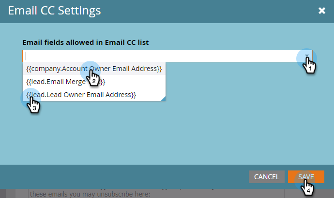

# Email CC {#email-cc}

Email CC allows specified emails being sent through Marketo to include CC recipients.

This feature is available on all Marketo email assets, regardless of how the email is sent (batch or trigger campaign). The CC recipient will receive an exact copy of the email sent to the chosen Marketo person. As such, any engagement activity (opens, clicks, etc.) will be logged to the activity log of the Marketo Person in the "To" line of the email. However, delivery activity (sent, delivered, hard bounce, etc.) _other than “soft bounce”_ will **not** register, as Marketo is not able to distinguish delivery events for the Marketo Person from the CC recipients'. Marketo will only CC up to 100k People at a time. If your smart list exceeds 100k and it's imperative every person on it gets CC'd, we recommend breaking your list up.

>[!NOTE]
>
>Email CC wasn't designed to be used with A/B Tests. You can use it anyway if you'd like, however as it's technically not supported, Marketo Support wouldn't be able to assist with any troubleshooting.

## Set Up Email CC {#set-up-email-cc}

1. In My Marketo, click **Admin**.

   

1. In the tree, select **Email**.

   

1. Click **Edit Email CC Settings**.

   

1. Select up to 25 Marketo Lead or Company fields (of type “Email”) to make available for use as CC addresses within emails. Click **Save** when done.

   

## Using Email CC {#using-email-cc}

1. Select your email and click **Edit Draft**.

   

1. Click **Email Settings**.

   

1. Select up to five fields you want used to CC people. In this example, we only want the Lead Owner CC'd. Click **Save** when done.

   

   It's as simple as that! In the above example, when you send the email, the Lead Owner of the recipients you chose will be CC'd.

   >[!NOTE]
   >
   >If an invalid email address is in a CC field, it will be skipped.

   For quick identification, the Email Summary view shows you if/which Email CC fields were selected.  

   

   If the email is approved, but the Marketo Admin disables one or more of the CC fields before the email is sent, **those people will not receive an email**. In that scenario, the Email Summary view will gray out any fields that were disabled post-approval but pre-send:

   

   >[!NOTE]
   >
   >You will also see the above error in the Email Settings section of the email draft.

## After the Send {#after-the-send}

* If a CC recipient clicks a tracked link in the email, click activity (like all other engagement activity) will be associated with the email's main recipient. Additionally, they may click through to a page with Marketo’s web tracking code (munchkin.js), causing them to be cookied as the main recipient.

>[!TIP]
>
>You have the option of [disabling some or all tracking links](/help/marketo/product-docs/email-marketing/general/functions-in-the-editor/disable-tracking-for-an-email-link.md) in an email.

* After an email campaign is executed, Send Email activity will include a list of all CC addresses that were included for each recipient of the mailing. If any CC addresses were skipped due to unsubscribe, it will be noted in the activity as well.
* Unsubscribe links and pages function normally in CC'd emails. This allows CC recipients to successfully unsubscribe if they wish (complying with anti-spam regulations), and a record of this action will be stored in the Marketo Database.
* People who are listed as unsubscribed in your Marketo Database will **not** receive emails via CC.
