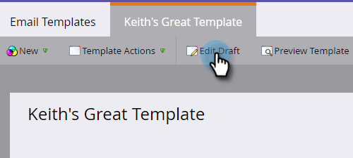

# Create an Email Template {#create-an-email-template}

Follow these steps to create a new email template.

>[!NOTE]
>
>Marketo Support is not set up to assist with troubleshooting custom HTML. For HTML assistance, please consult a web developer.

>[!CAUTION]
>
>The editor we use converts the values of color and background-color CSS properties to lowercase, so please avoid using camel case and use lowercase names or hyphens instead.

## Create a New Email Template {#create-a-new-email-template}

1. Click **[!UICONTROL Design Studio]**.

   

1. Click **[!UICONTROL New]**, then select **[!UICONTROL New Email Template]**.

   

1. Give your new template a name and click **[!UICONTROL Create]**.

   

1. To begin editing your new template, click **[!UICONTROL Edit Draft]**.

   

   >[!CAUTION]
   >
   >While there is no hard limit, once an email template is used by over 500 emails, re-approving that template after an update could result in performance issues. We recommend that once an email template has 500 emails associated to it, to create a new template.

## Save an Email as a Template {#save-an-email-as-a-template}

If you created an email you'd like to save as a template for future use, follow these simple steps.

1. Click **[!UICONTROL Marketing Activities]**.

   

1. Find and select your email, then click **[!UICONTROL Edit Draft]**.

   

1. Click the **[!UICONTROL Email Actions]** drop-down and select **[!UICONTROL Save as Template]**.

   

1. Click the **[!UICONTROL Folder]** drop-down, select where you want the template to live, and click **[!UICONTROL Save]**.

   

   And that's it!

   >[!CAUTION]
   >
   >When saving an email as a template, variable values will not carry over. Variables will continue to use the defaults specified in the underlying template. Available modules in the email will also not carry over unless they have been inserted into the email body.

To customize your email template, check out the article below.

>[!MORELIKETHIS]
>
>[Email Template Syntax](/help/marketo/product-docs/email-marketing/general/email-editor-2/email-template-syntax.md)
