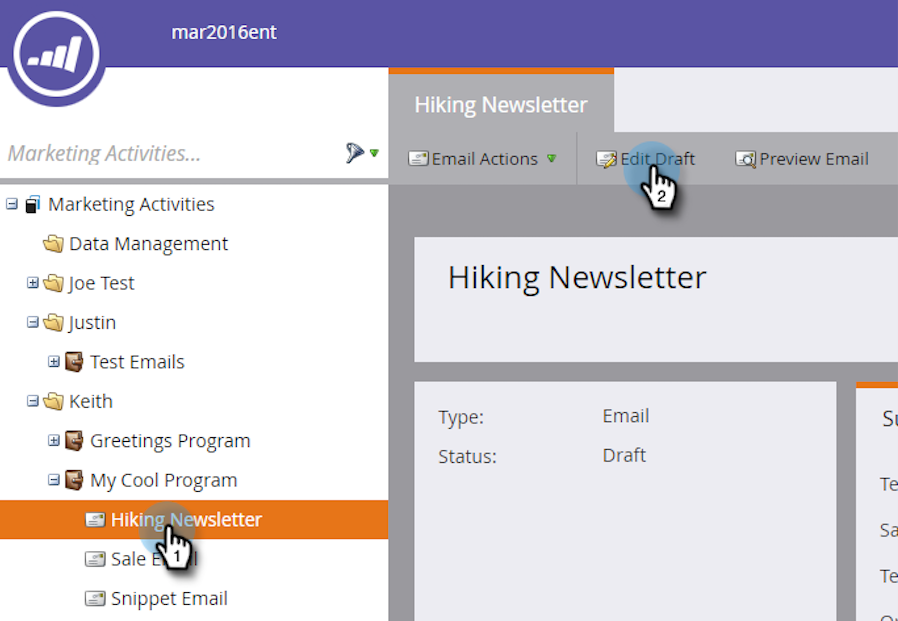
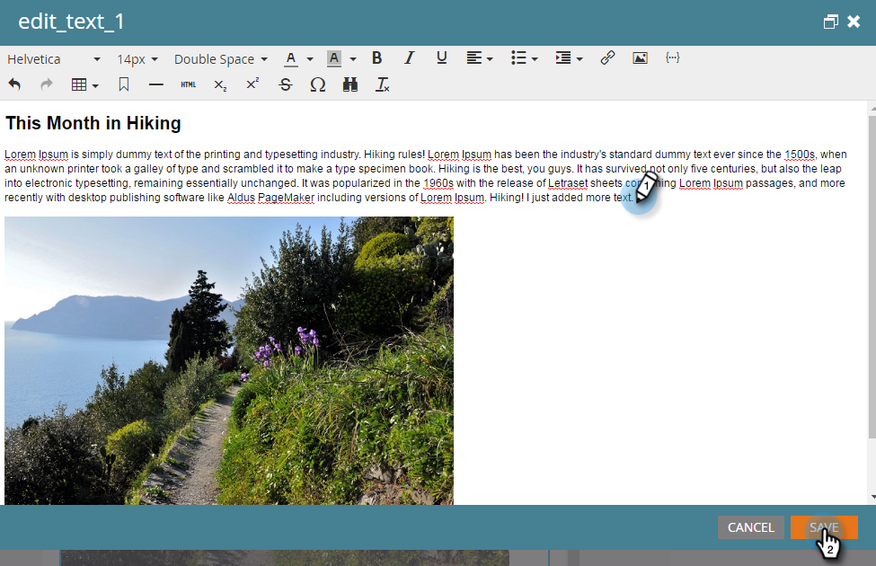
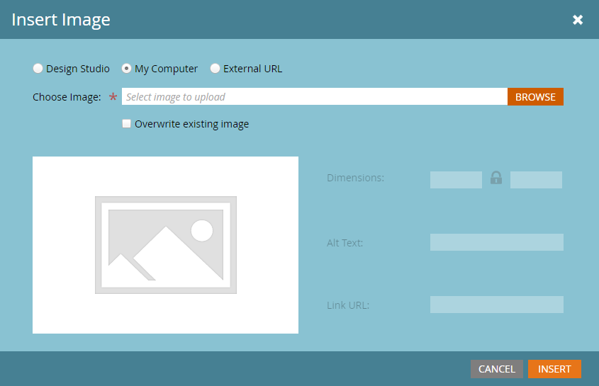
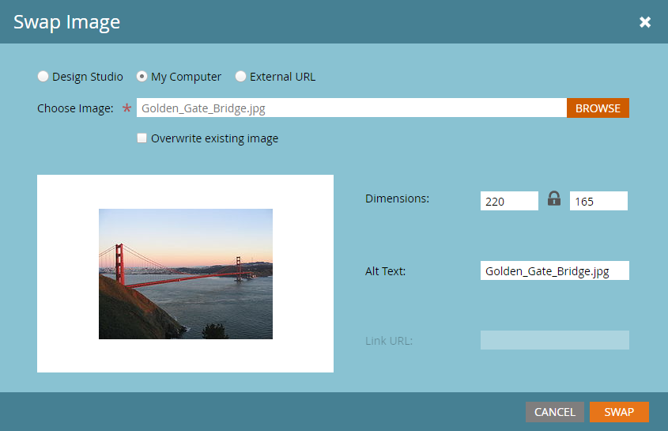
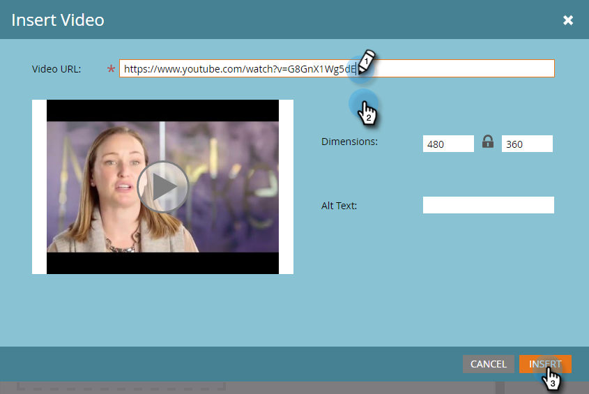

# Edit Elements in an Email {#edit-elements-in-an-email}

Emails can contain four different elements: Rich text, Images, Snippets, and Video. Here's how to edit each.

## How to Edit the Rich Text Element {#how-to-edit-the-rich-text-element}

1. Find your email, select it and click **Edit Draft**.

   

1. The email editor will open. Select the Rich text, click the gear icon and select **Edit**.

   

   You can also hover over the element in the right-hand pane, causing the gear icon to appear.

   

1. Add/Edit your text and press **Save**.

   

   >[!NOTE]
   >
   >**Reminder**
   >
   >
   >You can also add images, tokens, tables and other elements. See [Using the Rich Text Editor](../../../../product-docs/email-marketing/general/understanding-the-email-editor/using-the-rich-text-editor.md).

   >[!CAUTION]
   >
   >Avoid copying and pasting text from a rich text source, such as a website or a Word document. Instead, paste rich text into a plain text editor first, such as Notepad (Windows) or TextEdit (Mac). Once it's "clean," you can then copy it from the plain text editor and paste it into your email.

## How to Edit the Image Element {#how-to-edit-the-image-element}

1. Click inside the module with the Image element to select it.

   

1. Click the Image element you want to edit, then click the gear icon and select **Edit**.

   

   >[!NOTE]
   >
   >You can also double-click on the element to begin editing.

1. The image editor displays.

   

   You have three options for inserting an image. Let's look at each.

   **External URL**

   >[!NOTE]
   >
   >If you want to use a Marketo token, use this option. Keep in mind that when you use a token, the image will appear broken in the editor, but will render in Preview mode and the Send Sample email.

   **Swap** 

   **My Computer**

   To upload an image from your computer, click **Browse**.

   

   Navigate to where the image is on your computer and insert it.

   

   Alter the dimensions to suit your needs, change the Alt Text (optional), then press **Swap**.

   

   >[!NOTE]
   >
   >If you're replacing an image, you'll need to check the **Overwrite existing image** box that appears below the Image URL/name.

   **Design Studio**To insert an image from the Design Studio, simply locate it...

   

   **Swap** 
   

To use an external URL, paste in the image's URL first. Alter the dimensions to suit your needs, and add some Alt Text (optional). Then press .               ...and insert it. Alter the dimensions to suit your needs, change the Alt Text (optional), then press . 

## How to Edit the Snippet Element {#how-to-edit-the-snippet-element}

1. Click inside the module with the Snippet element.

   

1. Click the Snippet element, then the gear icon and select **Edit**.

   

1. Find your snippet, select it, and click **Save**.

   

1. Your snippet then populates.

   

## How to Edit the Video Element {#how-to-edit-the-video-element}

1. Click inside the module with the Video element.

   

1. Click the Video element, then the gear icon and select **Edit**.

   

1. Paste in the video URL from Vimeo or YouTube. Then click out of the URL box for the preview to load. Alter the dimensions to suit your needs, add Alt Text (optional), then press **Insert**.

   

   >[!NOTE]
   >
   >For YouTube videos use the full URL from the address bar, not the shortcut URL found in the Share option.

Have fun designing the perfect email!
