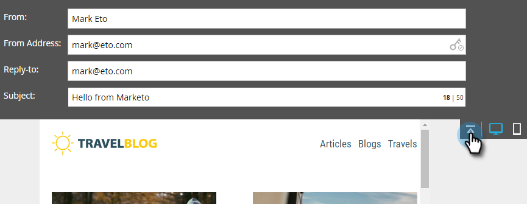
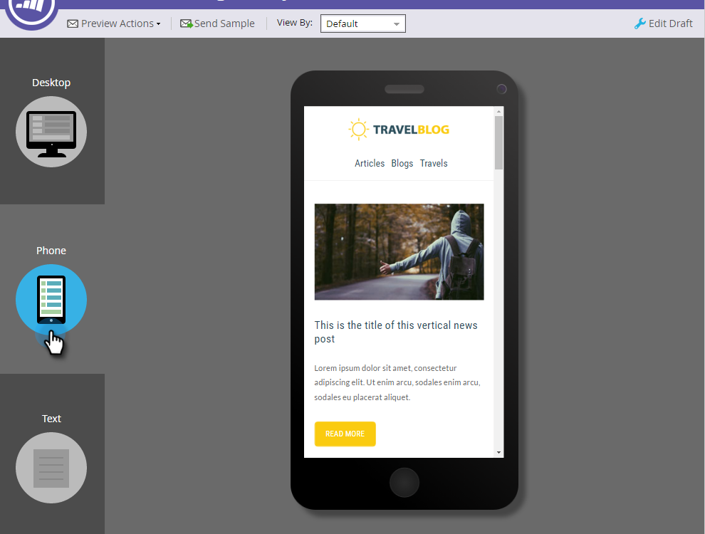

# Email Editor v2.0 Overview {#email-editor-v2-overview}

Overview of the classic email editor.

>[!IMPORTANT]
>
>While there is no exact date, the classic email editor will eventually be deprecated (we will announce an exact date when we have one). It is highly recommended to begin adoption of the advanced [Email Designer](/help/marketo/product-docs/email-marketing/email-designer/overview.md){target="_blank"}, as it has many capabilities not available in the classic editor.

## Email Template Picker {#email-template-picker}

When you create a new email, you are taken to the [Email Template Picker](/help/marketo/product-docs/email-marketing/general/email-editor-2/email-template-picker-overview.md).

## Email Editor {#email-editor}

When you start editing your email, you'll notice the editor has a whole new look.

### Modules {#modules}

Those things on the right side of the editor are called modules. Learn how to [add modules to your email](/help/marketo/product-docs/email-marketing/general/email-editor-2/add-modules-to-your-email.md).

### Text Version {#text-version}

Switching between the HTML version and Text versions of your email is now in a handy tab at the bottom. Learn how to [edit the text version of an email](/help/marketo/product-docs/email-marketing/general/creating-an-email/edit-the-text-version-of-an-email.md).

### Email Header {#email-header}

Want more design space? The email header can be hidden after you are done [editing it](/help/marketo/product-docs/email-marketing/general/creating-an-email/edit-your-email-header.md). Simply click on this icon...

...and the header collapses.

### Preview your Email {#preview-your-email}

By default the email displays how it would look on a desktop, as indicated by the highlighted blue icon. If you click on the icon to its right...

...you'll see how your email will render on a mobile device.

For a larger preview, click **[!UICONTROL Preview]** in the upper-right of the email.

The default view there is desktop...

...but you can also see how it will look on a mobile device. You can preview the text version, too! Simply click **[!UICONTROL Edit Draft]** in the upper-right to resume editing.

## Email Actions {#email-actions}

Under **[!UICONTROL Email Actions]**, you'll notice some new features. **[!UICONTROL Upload an Image or File]**, and **[!UICONTROL Grab Images from Web]**. You can also save the email itself as a new email template. All you have to do is give it a name and a destination.

>[!CAUTION]
>
>When saving an email as a template, variable values will not carry over. Variables will continue to use the defaults specified in the underlying template. Available modules in the email will also not carry over unless they been inserted into the email body.

>[!NOTE]
>
>**[[!UICONTROL Grab Images from Web]](/help/marketo/product-docs/demand-generation/images-and-files/grab-the-images-from-a-web-page.md)** works just like it does in the [!UICONTROL Design Studio].

## Email Settings {#email-settings}

Choose from a variety of additional settings that allow you to customize the email.

### Disable Open Tracking 

Under **[!UICONTROL Edit Settings]**, you can disable open tracking if necessary.

### Add a Preheader {#add-a-preheader}

You have the option of adding a [!UICONTROL Preheader]. A [!UICONTROL Preheader] is the short summary text after the subject line when emails are viewed in your inbox.

>[!CAUTION]
>
>Tokens do not work in the [!UICONTROL Preheader] when using the email editor. To use a token in the [!UICONTROL Preheader], it must be via your own HTML in an email template.

>[!MORELIKETHIS]
>
>[Email Template Syntax](/help/marketo/product-docs/email-marketing/general/email-editor-2/email-template-syntax.md)
