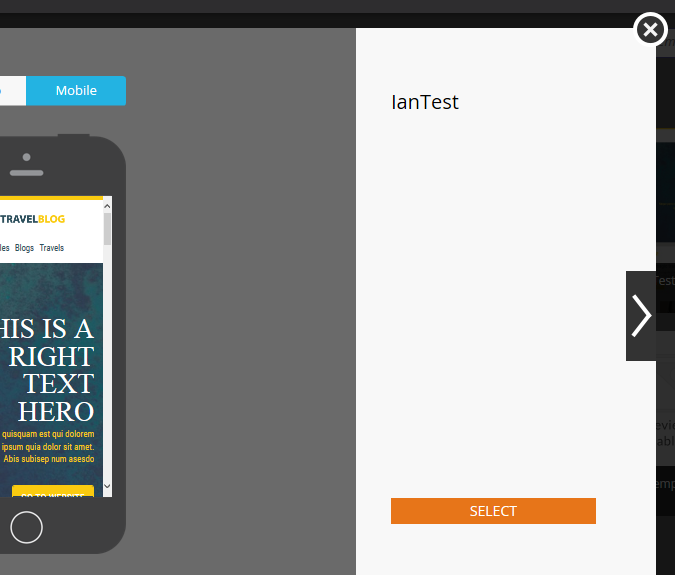

# Email Template Picker Overview {#email-template-picker-overview}

When you [create an email](/help/marketo/product-docs/email-marketing/general/creating-an-email/create-an-email.md), you have several free templates to choose from. You can also create your own template and save it for future use.

**[!UICONTROL Name]** will be the name of the email you create based off the template, not the template itself. **[!UICONTROL Description]** also applies to the email, and is optional.

If your email is critical and you want it to circumvent Communication Limits, [make it operational](/help/marketo/product-docs/email-marketing/general/functions-in-the-editor/make-an-email-operational.md) by checking the box. **[!UICONTROL Open in editor]** is selected by default, and simply means you want to start editing your new email right away. **[!UICONTROL Create]** means, create!

**[!UICONTROL Starter Templates]** includes a collection of ready-to-go responsive email templates. You may use them as-is, or customize them to your liking.

**[!UICONTROL My Templates]** consists of all the templates you've created. You may also have folders.

All folders that appear under **[!UICONTROL Emails]** > **[!UICONTROL Templates]** in your [!UICONTROL Design Studio] tree will be available in **[!UICONTROL My Templates]**.

To preview a template, hover over its thumbnail and click **[!UICONTROL Preview]**. You can also just double-click it.

The previewer shows you how the template will render on a desktop machine...

...and a mobile device.

If you like this template, choose it by clicking **[!UICONTROL Select]** on the bottom right. Wanna keep looking? Click the **X** on the upper right. Use the left and right arrows to scroll through templates.

You can also right-click on a template thumbnail for more options.

>[!NOTE]
>
>A cool thing about template thumbnails is, they're live. So if you make a change to a template, the thumbnail changes along with it.

Pretty neat!

>[!MORELIKETHIS]
>
>* [Email Template Syntax](/help/marketo/product-docs/email-marketing/general/email-editor-2/email-template-syntax.md)
>* [Create an Email](/help/marketo/product-docs/email-marketing/general/creating-an-email/create-an-email.md)
