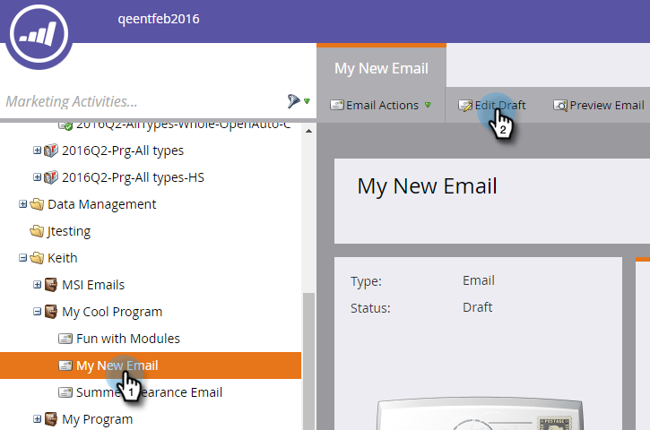
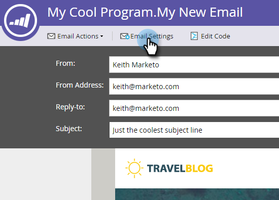
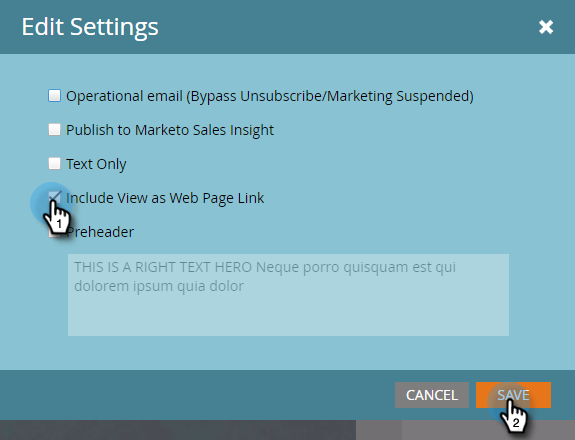

# Add a View as Web Page Link to an Email {#add-a-view-as-web-page-link-to-an-email}

Emails have limited capabilities (limited CSS and no JavaScript or forms). Use View as Web Page to provide a link to show your email in a browser. This will cookie the recipient using the Munchkin.

>[!NOTE]
>
>When creating a new email, View as Web Page is not enabled. If you enable it and clone the email, this setting will be copied.

1. Select your email and click **Edit Draft**.

   

1. In the email editor, click **Email Settings**.

   

1. Check the **Include View as Web Page** box and click **Save**.

   

Here's an example of how it looks:

>[!TIP]
>
>You will not see the View as Web Page link until you send the email. Send yourself a test to view.

To change the default text, see [Edit the "View as Web Page" Message](/help/marketo/product-docs/administration/email-setup/edit-the-view-as-web-page-message.md).
