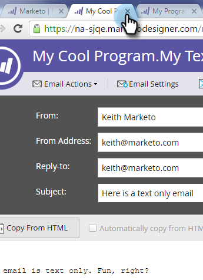

# Add Tracked Links to a Text Email {#add-tracked-links-to-a-text-email}

>[!PREREQUISITES]
>
>* [Create a Text Only Email](/help/marketo/product-docs/email-marketing/general/creating-an-email/create-a-text-only-email.md)
>* [Edit Elements in an Email](/help/marketo/product-docs/email-marketing/general/email-editor-2/edit-elements-in-an-email.md)

Text email links can be tracked in Marketo. Let's see how it works. 1. Select your email and click Edit Draft.

1. Double-click the editable area you want to add the link to.

   

1. Enter the URL with double brackets, like this: `[[www.domain.com/path/page.html]]`.

   

1. Close out of the editor, and don't forget to approve the draft.

   

>[!NOTE]
>
>The mktNoTok class functionality does not work with trackable links in text emails. Only for HTML emails.

>[!TIP]
>
>Test it out to double-check. Make sure you entered the brackets correctly.

Nice work!
