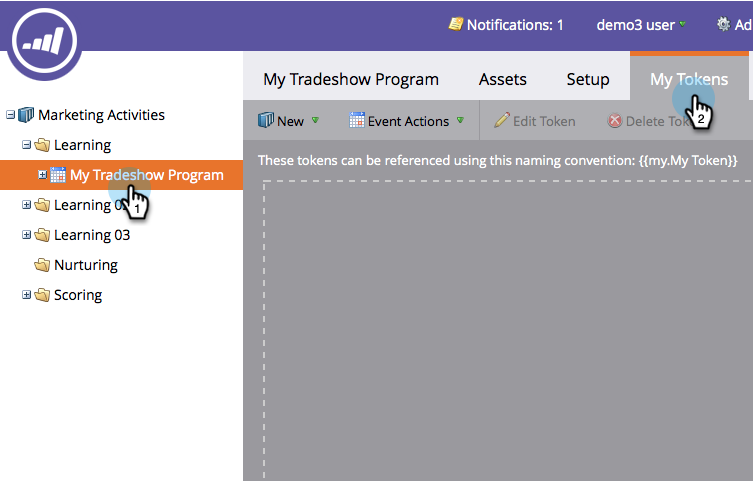
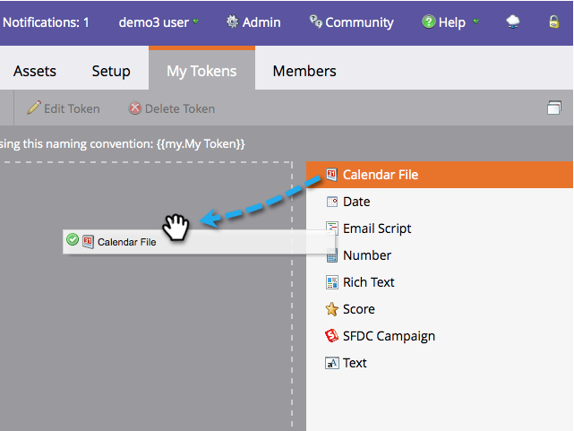
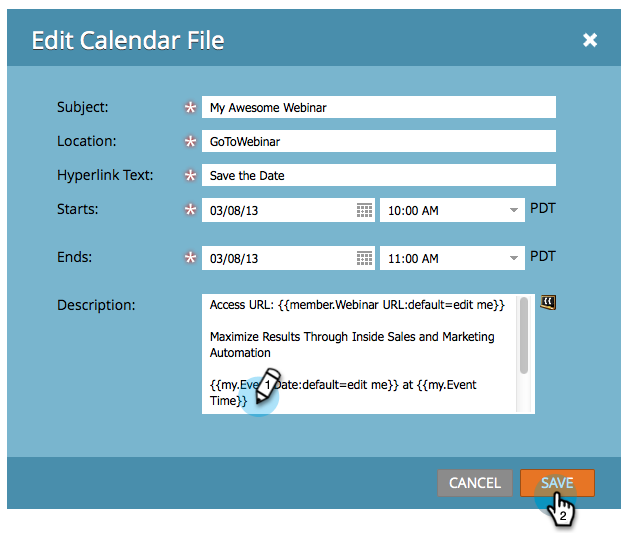

# Create a Calendar Event (.ics) File {#create-a-calendar-event-ics-file}

A Calendar File token allows you to add a calendar event (.ics) link to your Marketo emails and landing pages.

1. Inside your program, go to **[!UICONTROL My Tokens]** tab.

   

1. Drag a **[!UICONTROL Calendar File]** token to the canvas.

   

1. Enter a **Token Name** and click **[!UICONTROL Click to Edit]**.

   

1. Enter details and click **[!UICONTROL Save]**.

   

Mission accomplished! Make sure to test it out.

>[!MORELIKETHIS]
>
>* [Include a Calendar Event (.ics) in an Email](/help/marketo/product-docs/email-marketing/general/functions-in-the-editor/include-a-calendar-event-ics-in-an-email.md)
>* [Include a Calendar Event ICS File in a Landing Page](/help/marketo/product-docs/demand-generation/landing-pages/personalizing-landing-pages/include-a-calendar-event-ics-file-in-a-landing-page.md)
