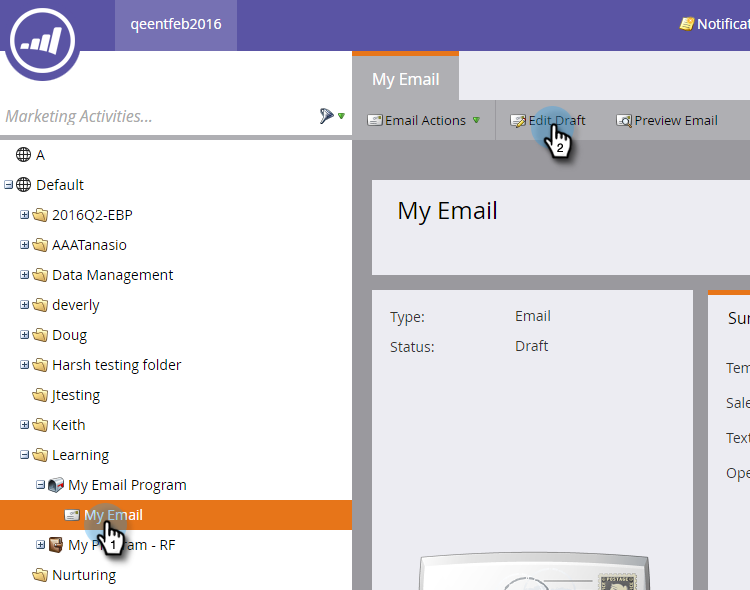
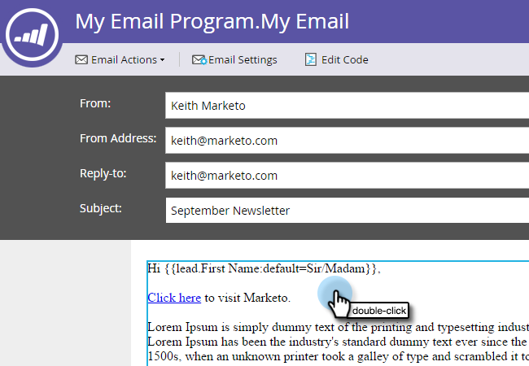
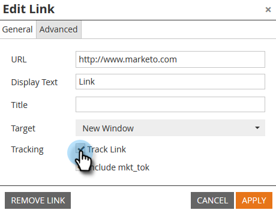
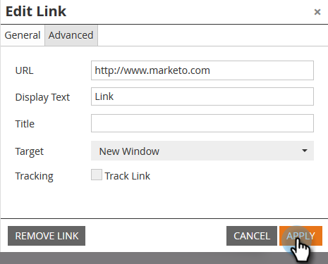

# Disable Tracking for an Email Link {#disable-tracking-for-an-email-link}

Sometimes you don't want to enable the **Marketo Tracking URL** on a link in an email. This is useful when the destination page does not support URL parameters and may result in a broken link.

>[!NOTE]
>
>Marketo is now standardizing language across all subscriptions, so you may see lead/leads in your subscription and person/people in docs.marketo.com. These terms mean the same thing; it does not affect article instructions. There are some other changes, too. [Learn more](/help/marketo/getting-started/updates-to-marketo-terminology.md).

1. Select your email and click **Edit** **Draft**.

   

1. Double-click the editable section that contains the link.

   

1. Click the link in question, then click the **Insert/Edit Link** button.

   

1. In the Edit Link pop-up, uncheck the **Track Link** checkbox.

   

1. You'll notice the **Include mkt_tok box** disappears. Click **Apply**.

   

   >[!TIP]
   >
   >Unchecking just **Include mkt_tok** will still allow the link to be tracked, but after redirect, the destination URL will not include the mkt_tok query string parameter. This parameter is used by Marketo Landing Pages and Munchkin to ensure proper tracking of person activities (like when a person unsubscribes from an email). You should avoid using this feature unless you're seeing weird behavior on your website due to the parameter being present.

1. Click **Save**.

   

   >[!TIP]
   >
   >Want to disable click-tracking for a link in an email **template**? Use this format:
   >`<a class="mktNoTrack" href="http://www.mywebsite.com">This link does not have tracking</a>`  
   >If you need help implementing this, please consult your web developer.

Nice! You have now disabled tracking for a link.
