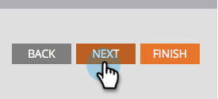
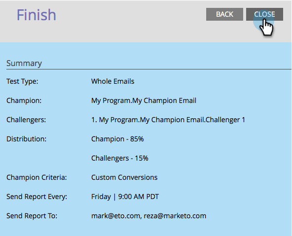
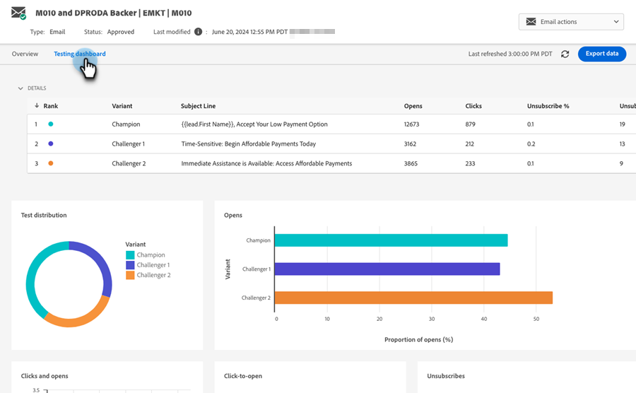

# Champion/Challenger: Analytics {#champion-challenger-analytics}

Receive report alerts and/or review the Champion/Challenger dashboard for helpful analytics.

>[!PREREQUISITES]
>
>[Champion/Challenger: Define Champion Criteria](/help/marketo/product-docs/email-marketing/general/functions-in-the-editor/email-tests-champion-challenger/champion-challenger-define-champion-criteria.md)

## Configure Report Alerts {#configure-report-alerts}

Marketo will send you reports on how the email test is going. Here's how to schedule it.

1. Let's schedule the report to send once a week on Friday at 9 AM.

   

   >[!TIP]
   >
   >You can select multiple days of the week if you'd like. Click to select, click again to de-select.

1. Enter the email address(es) that you want the reports sent to.

   

1. Click **Next**.

   

1. Verify that all the information is correct and click **Close**.

   

   The report will include details such as: test type, winner criteria, number of email opens, and more. There will also be a direct link to the test itself, allowing you to declare the winner! Cool stuff.

## Champion/Challenger Dashboard {#champion-challenger-dashboard}

The Champion/Challenger dashboard provides detailed analytics about the performance of the control and variants in your Champion/Challenger experimentation (opens, clicks, unsubscribe percentage, and other variables used during the configuration of the email test). The dashboard also provides distribution details regarding the targeted audience for various email variants, as well as aggregate proportion for opens, clicks, click-to-open ratio, and unsubscribes for all the variants.

   
