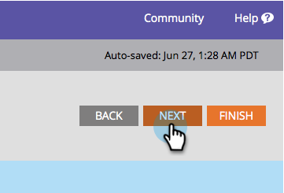

# Champion/Challenger: Configure Report Alerts {#champion-challenger-configure-report-alerts}

Marketo will send you reports on how the email test is going. Here's how to schedule it.

>[!PREREQUISITES]
>
>[Champion/Challenger: Define Champion Criteria](/help/marketo/product-docs/email-marketing/general/functions-in-the-editor/email-tests-champion-challenger/champion-challenger-define-champion-criteria.md)

1. Let's schedule the report to send once a week on Friday at 9 AM.

   

   >[!TIP]
   >
   >You can select multiple days of the week if you'd like. Click to select, click again to de-select.

1. Enter the email address(es) that you want the reports sent to.

   

1. Click **Next**.

   

1. Verify that all the information is correct and click **Close**.

   

   The report will include helpful details, such as: test type, winner criteria, number of email opens, and more. There will also be a direct link to the test itself, allowing you to declare the winner! Cool stuff.

   >[!MORELIKETHIS]
   >
   >[Champion/Challenger: Approve Your Email Test](/help/marketo/product-docs/email-marketing/general/functions-in-the-editor/email-tests-champion-challenger/champion-challenger-approve-your-email-test.md)
