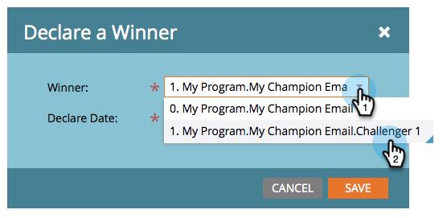
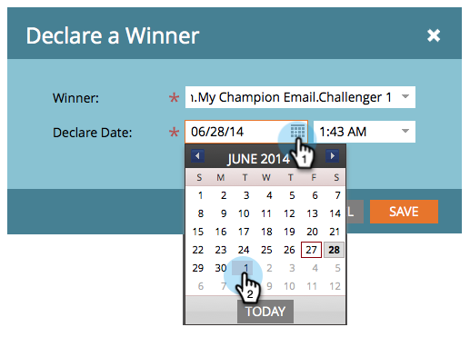

# Champion/Challenger: Declare a Champion {#champion-challenger-declare-a-champion}

When you're ready, you can declare a champion for your email test.

>[!NOTE]
>
>**Related Articles**
>
>* [Champion/Challenger: Approve Your Email Test](champion-challenger-approve-your-email-test.md)
>

1. Go to **Marketing Activities**.

   

1. Find and right-click your email test, then click **Declare Champion**.

   

1. Select the **Winner** of your choice.

   

1. Set the **Declare Date**.

   >[!NOTE]
   >
   >Until the&nbsp;**Declare Date**,&nbsp;Marketo&nbsp;will continue to send the old champion and challenger(s). Once date/time is reached, only the new champion will be sent.

   

   >[!CAUTION]
   >
   >Notice that the default&nbsp;**Declare Date**&nbsp;is tomorrow, not today.

   Select a time and click&nbsp;**Save**.   

   Rad! Now you know how to easily run an email test to improve your content without interruptions to your campaign.

   >[!NOTE]
   >
   >**Deep Dive**
   >
   >
   >Learn more about [email marketing](../../../../../product-docs/email-marketing.md).

