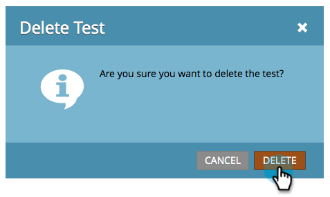

# Champion/Challenger: Discard an Email Test {#champion-challenger-discard-an-email-test}

If, at any point, you decide you don't want to continue running your email test, you can discard it. Here's how.

>[!PREREQUISITES]
>
>[Champion/Challenger: Approve Your Email Test](/help/marketo/product-docs/email-marketing/general/functions-in-the-editor/email-tests-champion-challenger/champion-challenger-approve-your-email-test.md)

1. Go to **[!UICONTROL Marketing Activities]**.

   

1. Find and right-click your email test, then click **[!UICONTROL Discard Test]**.

   

1. Click **[!UICONTROL Delete]** to confirm.

   

   You're done! If you ever decide you want to set up a test again, go ahead and [add an email champion/challenger](/help/marketo/product-docs/email-marketing/general/functions-in-the-editor/email-tests-champion-challenger/add-an-email-champion-challenger.md).
