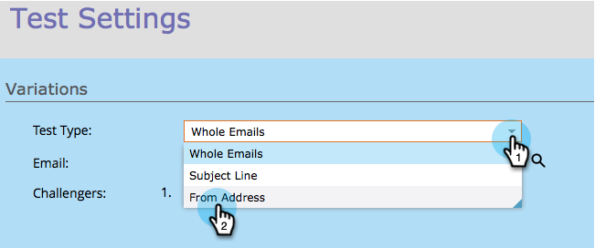
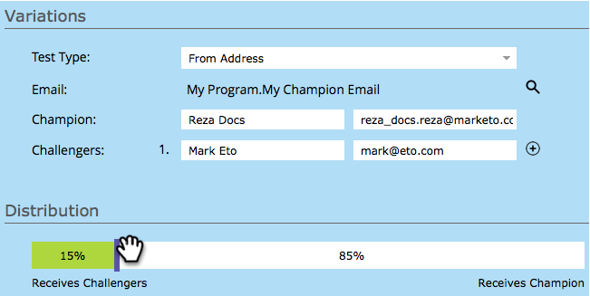
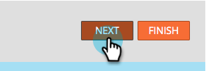

# Champion/Challenger: From Address {#champion-challenger-from-address}

Want to try out a different From Address with no fuss? Here's how.

>[!PREREQUISITES]
>
>[Add an Email Champion/Challenger](/help/marketo/product-docs/email-marketing/general/functions-in-the-editor/email-tests-champion-challenger/add-an-email-champion-challenger.md)

1. In the email test editor, select **From Address** in the **Test Type** drop-down.

   

   >[!NOTE]
   >
   >The first From Address is designated as the **Champion**. Subsequent from addresses are called **Challengers**.

1. Enter the **From Name** (left) and **From Address** (right) for the challengers.

   

   >[!TIP]
   >
   >If you want more than one challenger, click the plus sign and enter another name and email.

1. Drag the slider to decide the percentage split between people who receive emails with the champion From Address and those who receive emails with the challenger From Address(es).

   

   >[!NOTE]
   >
   >**Example**
   >
   >In the distribution shown above, 15% of the total audience specified in the smart list gets one of the emails with a challenger From Address and 85% receive the email with the champion From Address. Emails for multiple challenger From Addresses share the 15% equally. When the test is over, you can declare a winner manually. From then on, all future people receive the better performing content.

   To gain statistical confidence, be sure you choose a percentage that includes enough people that your test is valid. Don't be fooled by inconclusive results. [More information than you ever wanted about statistical confidence](https://en.wikipedia.org/wiki/Confidence_interval).

1. Click **Next**.

   

   Progress! Let's keep on it.

   >[!MORELIKETHIS]
   >
   >[Champion/Challenger: Define Champion Criteria](/help/marketo/product-docs/email-marketing/general/functions-in-the-editor/email-tests-champion-challenger/champion-challenger-define-champion-criteria.md)
