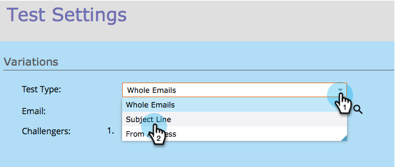
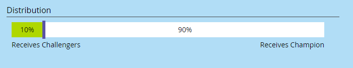

# Champion/Challenger: Subject Line {#champion-challenger-subject-line}

You can easily test multiple subject lines. When the test is over, send out emails with the most effective one. Here's how to do it.

>[!NOTE]
>
>**Prerequisites**
>
>* [Add an Email Champion/Challenger](add-an-email-champion-challenger.md)
>

1. In the email test editor, select **Subject Line** in the **Test Type **drop-down.

   

   >[!NOTE]
   >
   >In a subject test, the first subject line entered is designated as the **Champion**. Subsequent subject lines are called **Challengers**.

1. Enter subject line(s) for the **Challengers**.

   

   >[!TIP]
   >
   >If you want more than one challenger, click the plus sign and enter another subject line.

1. Drag the slider to decide the percentage split between people who receive the champion subject line versus challenger subject line(s).

   

   >[!NOTE]
   >
   >**Example**
   >
   >
   >In the distribution shown above, 10% of the total audience specified in the smart list gets one of the emails with the challenger subject line and 90% receive emails with the champion subject line. Emails with multiple challenger subject lines share the 10% equally. When the test is over, you can declare a winner manually. From then on, all future people receive the better performing content.

   To gain statistical confidence, make sure the percentage you choose includes enough people, so that your test is valid. Don't be fooled by inconclusive results.  [More information than you ever wanted about statistical confidence](http://en.wikipedia.org/wiki/Confidence_interval).

1. Click **Next**.

   

   Progress! Let's keep on it.

   >[!NOTE]
   >
   >**Related Articles**
   >
   >
   >[Champion/Challenger: Define Champion Criteria](champion-challenger-define-champion-criteria.md)

