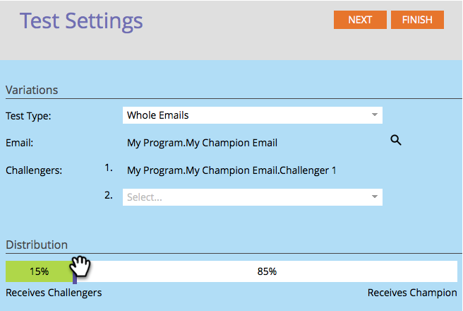

# Champion/Challenger: Whole Emails {#champion-challenger-whole-emails}

Test whole emails against each other. When the test is over, send out the top performer.

>[!PREREQUISITES]
>
>[Add an Email Champion/Challenger](/help/marketo/product-docs/email-marketing/general/functions-in-the-editor/email-tests-champion-challenger/add-an-email-champion-challenger.md)

1. In the email test editor, select **Whole Emails** in the **Test Type** drop-down.

   

   >[!NOTE]
   >
   >Remember: The original email is the champion. The challengers compete against it.

1. Find and select the **Challengers** email(s), then click **Clone**.

   

   >[!TIP]
   >
   >Cloning makes a copy of the challenger email under the email test.

1. Drag the slider to decide the percentage split of people who receive the challenger versus champion emails.

   

   >[!NOTE]
   >
   >**Example**
   >
   >In the distribution shown above, 15% of the total audience specified in the Smart List gets one of the challenger emails and 85% receive the champion email. Multiple challenger emails share the 15% equally. When the test is over, you can declare a winner manually. From then on, all future people receive the better performing content. In Trigger Campaigns, the realized percentage may differ from the percentage you select, as the distribution may not align precisely with the chosen percentages. This can happen when one variant processes a significant number of unsubscribed persons, or when one variant is an operational email while the others are not.

   To gain statistical confidence, be sure that the percentage you assign to challengers includes enough people that your test is valid. Don't be fooled by inconclusive results.

1. Click **Next**.

   

1. Progress! Let's keep on it.

   >[!MORELIKETHIS]
   >
   >[Champion/Challenger: Define Champion Criteria](/help/marketo/product-docs/email-marketing/general/functions-in-the-editor/email-tests-champion-challenger/champion-challenger-define-champion-criteria.md)
