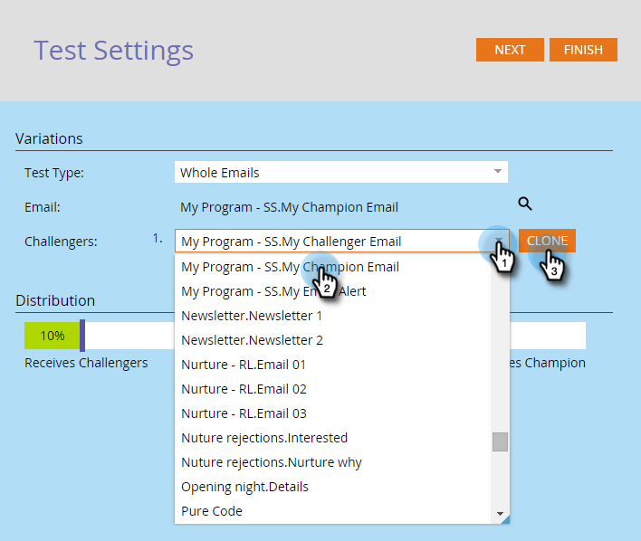

# Champion/Challenger: Whole Emails {#champion-challenger-whole-emails}

Champion/Challenger: Whole Emails - Marketo Docs - Product Documentation

Test whole emails against each other. When the test is over, send out the top performer.

>[!NOTE]
>
>**Prerequisites**
>
>* [Add an Email Champion/Challenger](add-an-email-champion-challenger.md)
>

1. In the email test editor, select **Whole Emails** in the **Test Type **dropdown.

   

   >[!NOTE]
   >
   >Remember: The original email is the champion. The challengers compete against it.

1. Find and select the **Challengers** email(s), then click **Clone**.

   

   >[!TIP]
   >
   >Cloning makes a copy of the challenger email under the email test.

1. Drag the slider to decide the percentage split of people who receive the challenger versus champion emails.

   

   >[!NOTE]
   >
   >**Example**
   >
   >
   >In the distribution shown above, 15% of the total audience specified in the smart list gets one of the challenger emails and 85% receive the champion email. Multiple challenger emails share the 15% equally. When the test is over, you can declare a winner manually. From then on, all future people receive the better performing content.

   [More information than you ever wanted about statistical confidence](http://en.wikipedia.org/wiki/Confidence_interval).

1. Click **Next**.

   

1. Progress! Let's keep on it.

   >[!NOTE]
   >
   >**Related Articles**
   >
   >    
   >    
   >    * [Champion/Challenger: Define Champion Criteria](champion-challenger-define-champion-criteria.md)
   >    
   >

To gain statistical confidence, be sure that the percentage you assign to challengers includes enough people that your test is valid. Don't be fooled by inconclusive results. 