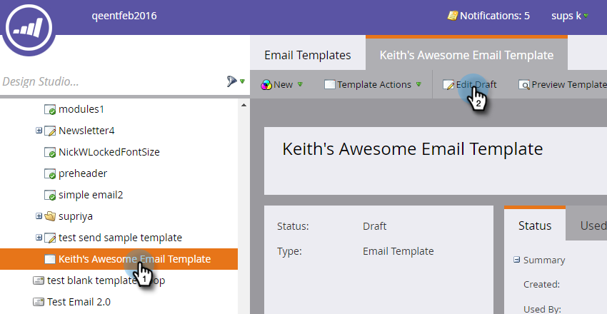
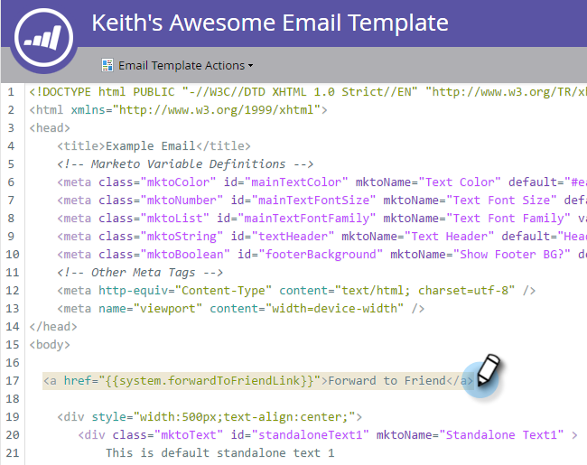
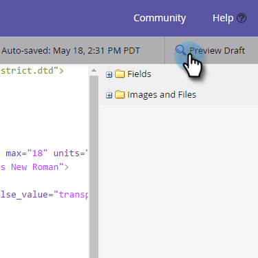
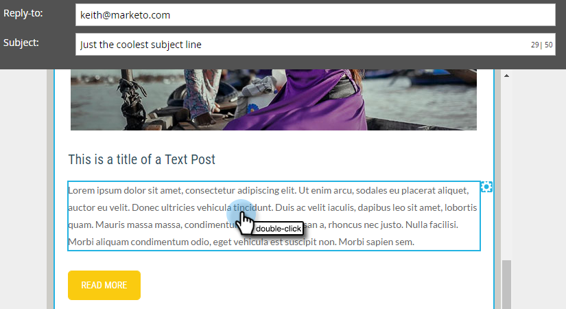
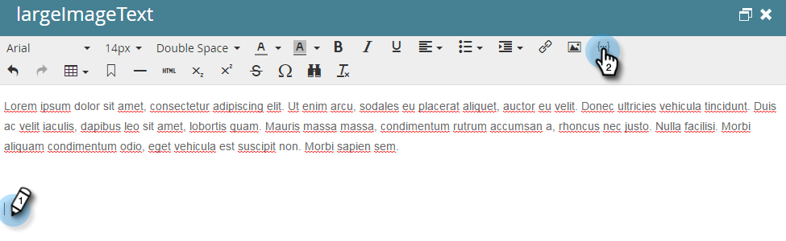
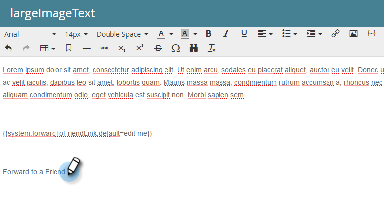
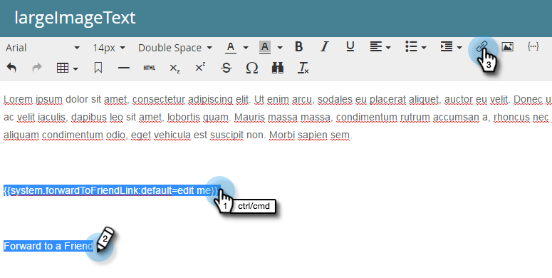
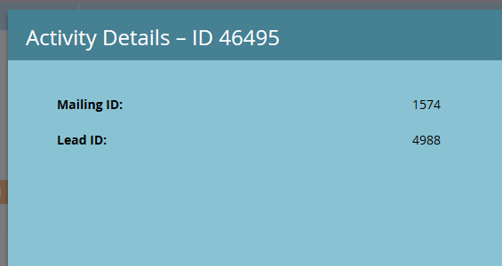

# Forward to a Friend Link in Emails {#forward-to-a-friend-link-in-emails}

Adding the ‘Forward to Friend’ link to your emails allows you to track people who have received a forwarded email through this link, and automatically adds them as a new person if they are not already in the database.

For example, say Keith uses the ‘Forward to Friend’ link to forward the email to an unknown person, Mark. Mark is automatically added as a new person, gets assigned his own cookie, and any of his email and web activity is linked to him. However, if Keith uses the forward button in his email client, Mark gets incorrectly cookied as Keith, and his activity gets logged as Keith's.

## Add the Link to an Email Template {#add-the-link-to-an-email-template}

1. Go to the **Design Studio**.

   

1. Find and select the email template you want to add the link to. Click **Edit Draft**.

   

1. Paste the following HTML code where you want the 'Forward to Friend' link to appear (if you need help with this part, please confer with your web developer):

   `<pre data-theme="Confluence"><a href="{{system.forwardToFriendLink}}">Forward to Friend</a></pre>`

   

   >[!TIP]
   >
   >
   >You can add styling to the link to make it look nicer. For example:
   >
   >`<a href="{{system.forwardToFriendLink}}" style="font-family:arial, sans-serif; padding:10px; position:absolute; right:0px;">Forward to Friend</a>`

   >[!CAUTION]
   >
   >We do not recommend using the styling **position:relative** in your email template. It may create issues with the position and display of the ‘Forward to Friend’ box.

1. Click **Preview Draft** to make sure the template looks the way you want it to.

   

   >[!NOTE]
   >
   >Remember to approve the template draft to apply the changes.

   Now all emails that use that template will have the 'Forward to Friend' link. When the email recipient clicks it, they will be taken to a web version of the email with the ‘Forward to a Friend’ box:

   

## Add the Link to an Individual Email {#add-the-link-to-an-individual-email}

You can also add the 'Forward to Friend' link directly into an email.

1. Open the email you want to include the link in, and double-click in the editable area.

   

1. Put the cursor where you want the link to appear and click the **Insert Token** button.

   

1. Select the **`{{system.forwardToFriendLink}}`** token.

   

   >[!NOTE]
   >
   >This token is the URL of the web version of the email with a ‘Forward to Friend’ box.

1. Write out what you want the display text of the link to be (for example, “Forward to a Friend”).

   

1. Cut the **`{{system.forwardToFriendLink}}`** token using Ctrl+X (Windows) or Cmd+X (Mac). Highlight “Forward to a friend” and click the **Insert/Edit Link** button.

   

1. Paste the **`{{system.forwardToFriendLink}}`** token into the **URL** box using Ctrl/Cmd+V, then click **Insert**.

   

1. Save the edit and preview your new link!

   

   >[!NOTE]
   >
   >New people that get added through receiving a ‘Forward to a Friend’ email are by default unsubscribed to marketing emails.

## View Forwarding Activity {#view-forwarding-activity}

You can see who forwarded and received the emails in the person's Activity Log.

1. Go to the **`Database`**.

   

1. Double-click the person you want to view activity for.

   

1. Go to the **Activity Log** tab. Double-click **Received Forward to Friend Email** or **Sent Forward to Friend Email** to see details.

   

   >[!NOTE]
   >
   >**Definition**
   >
   >For Received Forward to Friend Email, the Person ID is the person who forwarded the email.
   >
   >For Sent Forward to Friend Email, the Person ID is the person who received the email.

   

1. To view a person by ID, copy and paste the **Person ID** to the end of the URL (the beginning of said URL will depend on your Marketo instance):

   `<pre data-theme="Confluence">...marketo.com/Database/loadPersonDetail?personId=</pre>`

   >[!NOTE]
   >
   >We will make the **Person ID** clickable and link directly to the person in an upcoming patch.

   

   >[!NOTE]
   >
   >If the friend receiving the forward is an unknown person, a new person is created with ‘Forward to Friend’ marked as the person’s **Source**.
   >If the email is a local asset of a program, the program is marked as the person’s **Acquisition Program**.

## Trigger or Filter using Forwarding Activity {#trigger-or-filter-using-forwarding-activity}

There are six triggers/filters you can use to trigger flow actions or filter people by sent and received ‘Forward to Friend’ activity.

In a smart campaign's smart list, if you search for “forward” you will find the available triggers and filters.

## Test Forward to Friend {#test-forward-to-friend}

To test ‘Forward to Friend,’ send yourself an email with the forward link. Make sure you send it through the **Send Email** flow step, *not* through **Send Test Email**.
