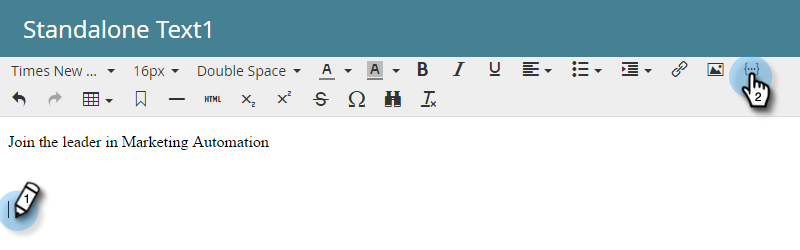
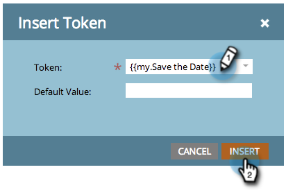
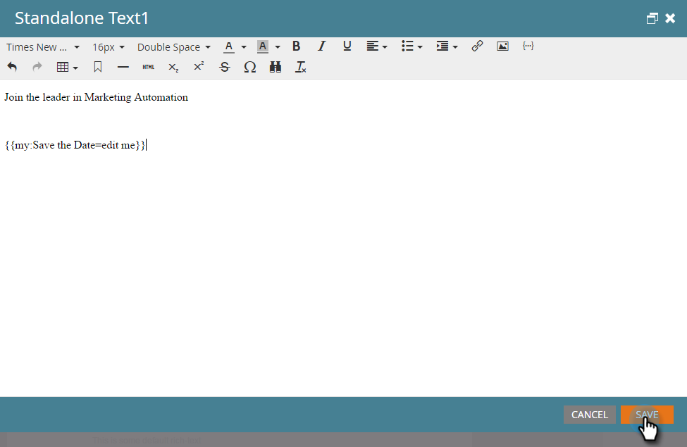

# Include a Calendar Event (.ics) in an Email {#include-a-calendar-event-ics-in-an-email}

 A Calendar File token allows you to add a calendar event (.ics) link to your Marketo emails.

>[!NOTE]
>
>**Prerequisites**
>
>* [Create a Calendar Event (.ics) File](create-a-calendar-event-ics-file.md)
>

1. While editing your program's email, click where you want the token to go, then click the Insert Token button.

1. Select the Calendar File token and click **Insert**.

   

   Click Save.

   

   Your recipients will receive an email that looks like this.

   

Mission accomplished!
