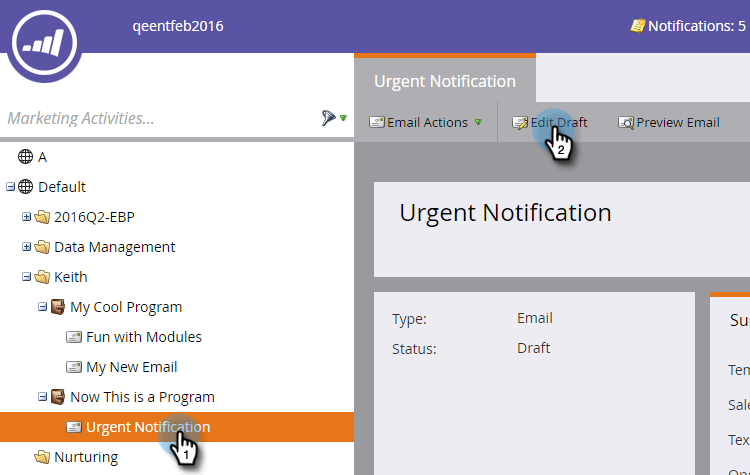
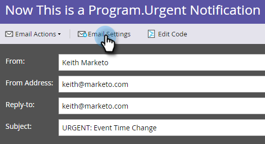
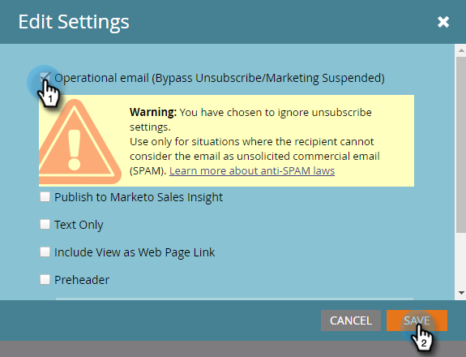

# Make an Email Operational {#make-an-email-operational}

Operational emails ignore Unsubscribed and Marketing Suspended statuses. They send no matter what.

>[!NOTE]
>
>Operational emails are not subject to communication limits.

1. Find your email, select it and click **Edit Draft**.

>[!NOTE]
>
>You should only use Operational emails for critical emails and auto-responders. They are not meant for marketing emails.

1. Once the editor opens, click **Email Settings**.

   

1. Check **Operational Email** and click **Save**.

   

>[!CAUTION]
>
>Operational emails weren't designed to work with engagement programs. Thus, an engagement program will ignore an email's operational status. Please keep that in mind when working with them.

Don't forget to approve this email in order for the changes to take effect. Learn how to  [approve an email](/help/marketo/product-docs/email-marketing/general/creating-an-email/approve-an-email.md).
