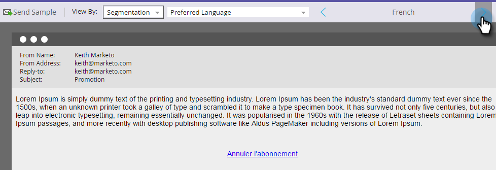
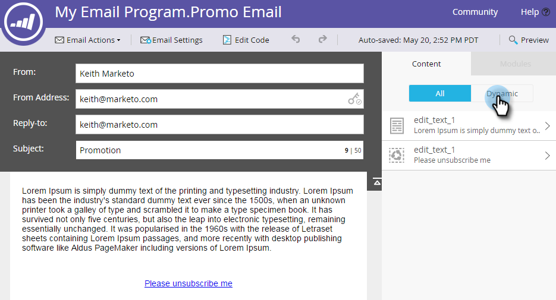
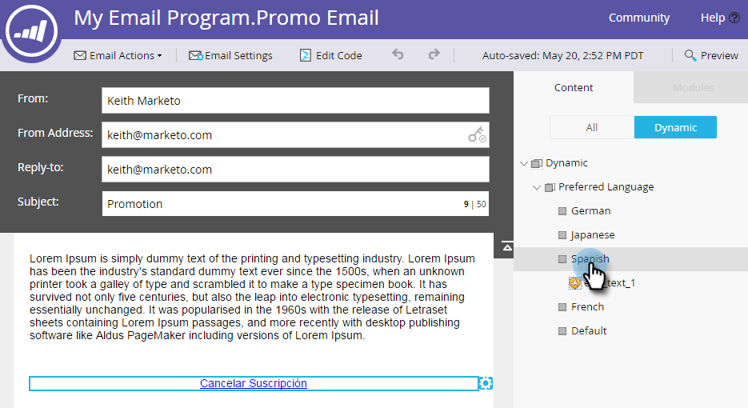

# Preview an Email with Dynamic Content {#preview-an-email-with-dynamic-content}

Preview your email after adding dynamic content in order to verify it.

1. Select your email and click **[!UICONTROL Preview Email]**.

   

1. Click the **[!UICONTROL View By]** drop-down and select the type of dynamic content you want to preview.

   

1. A new drop-down appears. Click it and choose the specific content.

   

1. Use the arrows to scroll through the options.

   

You can also preview dynamic content directly in the email editor.

1. Under **[!UICONTROL Content]**, click the **[!UICONTROL Dynamic]** tab.

   

1. Click the content you'd like to preview.

   

Great! Preview your emails to make sure the content is the way you want it.
