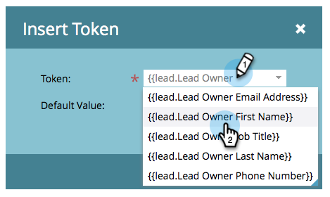
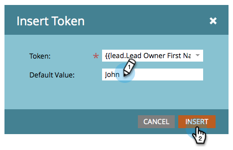
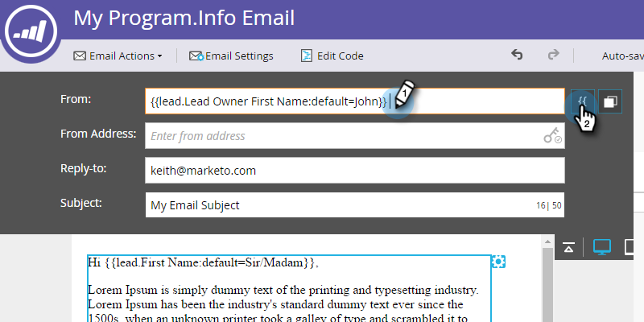
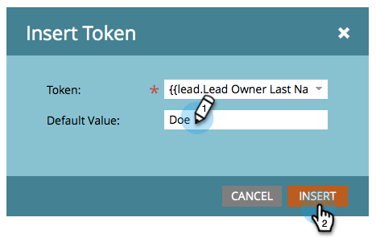
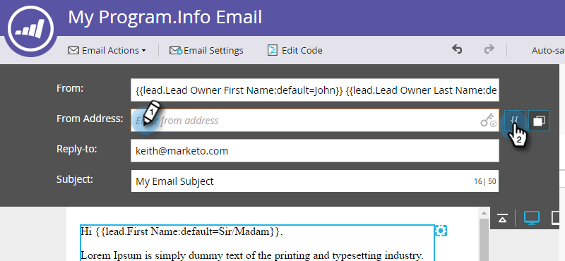
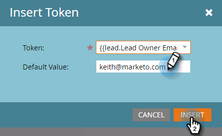
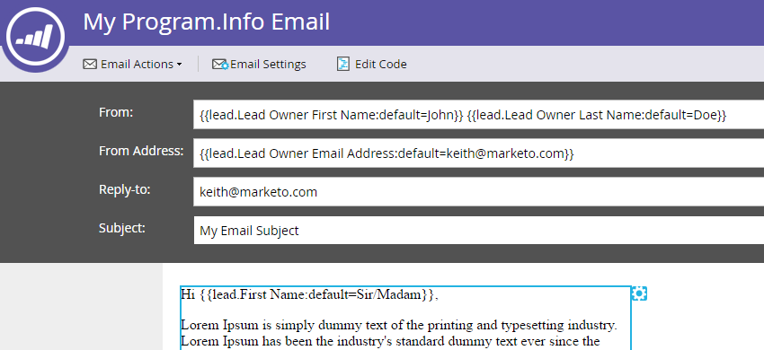

# Send Emails from the Lead Owner {#send-emails-from-the-lead-owner}

What if you want to send an email to a lead on behalf of the Lead Owner?  Here's how.

1. Find your email, select it and click **Edit Draft**.

   

1. Click in the **From** field (delete any existing name), and click the **Insert Token** button.

   

1. Start typing "`{{lead.Lead Owner`" and select the **`{{lead.Lead Owner First Name}}`** token.

   

1. Enter a default value in case the lead does not yet have a lead owner and click **Insert**.

   

1. Click after the first token, add a space, then click the **Insert Token** button.

   

1. Start typing "`{{lead.Lead Owner`" and select the **`{{lead.Lead Owner Last Name}}`** token.

   

1. Enter a default value in case the lead does not yet have a lead owner and click **Insert**.

   

   >[!TIP]
   >
   >Make sure you added a space between the first and last name tokens.

1. Click in the From Email field (delete any existing email address), and click the Insert Token button.

   

1. Start typing "`{{lead.Lead Owner`" and select the **`{{lead.Lead Owner Email Address}}`** token.

   

1. Enter a default value in case the lead does not yet have a lead owner and click **Insert**.

   

1. Make sure the **Reply-to** and **Subject** fields are populated, and you're done!

   
