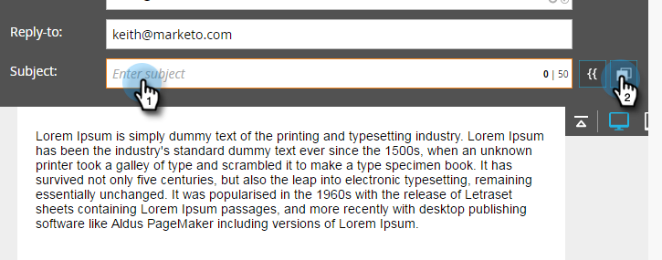
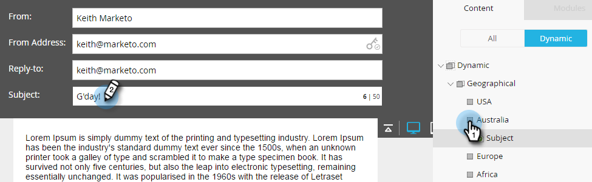

# Using Dynamic Content in an Email {#using-dynamic-content-in-an-email}

>[!PREREQUISITES]
>
>[Create a Segmentation](/help/marketo/product-docs/personalization/segmentation-and-snippets/segmentation/create-a-segmentation.md)

Use Dynamic Content in Emails to send your leads targeted information.

>[!NOTE]
>
>The use of variables within dynamic content in an email is only supported when using Trigger Campaigns. It is **not** supported when using Batch Campaigns.

## Add Segmentation {#add-segmentation}

1. Go to **[!UICONTROL Marketing Activities]**.

   

1. Select your email and click **[!UICONTROL Edit Draft]**.

   

1. In this example we're making the Subject Line dynamic. Click in the [!UICONTROL Subject] field, then click the **Make Dynamic** button.

   

   >[!NOTE]
   >
   >You can also make an element inside the email dynamic. To do this, select the area, click the gear icon, and select **Make Dynamic** (or [Replace with Snippet](/help/marketo/product-docs/personalization/segmentation-and-snippets/snippets/create-a-snippet.md), depending on what you are doing).

1. Enter the Segmentation name, select it, and click **[!UICONTROL Save]**.

   

   Your segmentation and its segments appear under the [!UICONTROL Dynamic] tab on the right.

   

## Apply Dynamic Content {#apply-dynamic-content}

>[!CAUTION]
>
>The number of dynamic content elements allowed is not unlimited. While there is no specific number limit (it can vary based on the combination of content), overusing dynamic content can negatively affect the email's performance. We recommend keeping the amount of dynamic content elements used to under 20 per email.

1. Click your segments and add your subject line.

1. Repeat for each segment.

   

>[!TIP]
>
>Create a default email before applying content to the various segments.

>[!CAUTION]
>
>Changes to Default segment content block gets applied to all segments.

Sweet! Now you can send flexible emails to your target audience.

>[!MORELIKETHIS]
>
>* [Preview an Email with Dynamic Content](/help/marketo/product-docs/email-marketing/general/functions-in-the-editor/preview-an-email-with-dynamic-content.md)
>* [Use Dynamic Content in a Landing Page](/help/marketo/product-docs/demand-generation/landing-pages/free-form-landing-pages/use-dynamic-content-in-a-free-form-landing-page.md)
