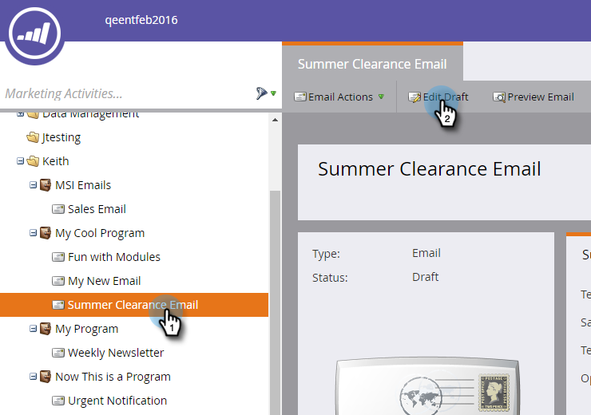
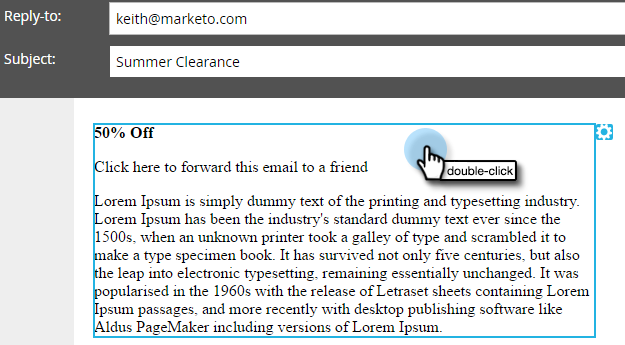
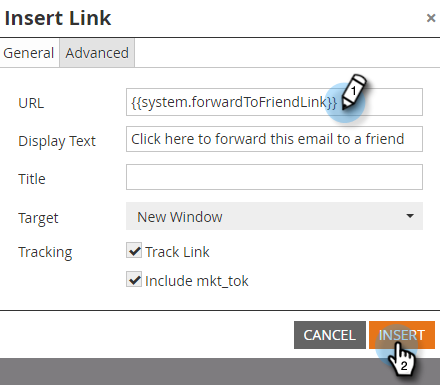

# Add a System Token as a Link in an Email {#add-a-system-token-as-a-link-in-an-email}

Add a System Token as a Link in an Email - Marketo Docs - Product Documentation

You can use these system tokens to customize the position of special links in your emails.

The following tokens can be used as links in an email or email template:

* {{system.forwardToFriendLink}}
* {{system.unsubscribeLink}}
* {{system.viewAsWebpageLink}}

>[!NOTE]
>
>These tokens will **not** be clickable unless inside an anchor link. Also, they can **not** be embedded into a My Token.

Here's how to add them to an email:

1. Find and select your email, then click **Edit Draft**.

   

1. Double-click in an editable area.

   

1. Highlight the text you want to convert to a link which will have the token and click the **Insert/Edit Link** button.

   

1. Enter the token in Link URL and click **Insert**.

   

   >[!TIP]
   >
   >Copy/Paste the token you want: **{{system.forwardToFriendLink}}** or **{{system.unsubscribeLink}}** or **{{system.viewAsWebpageLink}}**

1. Click **Save**.

   

>[!NOTE]
>
>**Reminder**
>
>Don't forget to [approve your email](../../../../product-docs/email-marketing/general/creating-an-email/approve-an-email.md) when done.

Nicely done! Now you know how to add a system token as a link in an email. 