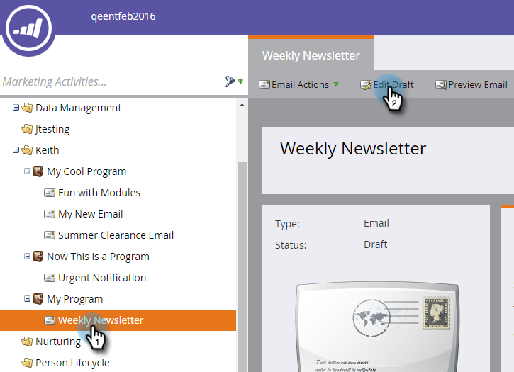
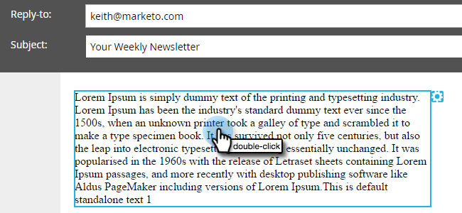

# Add an Email Script Token to Your Email {#add-an-email-script-token-to-your-email}

After you've [created your email script](/help/marketo/product-docs/email-marketing/general/using-tokens/create-an-email-script-token.md), you'll want to add it to an email to see it in action. Here's how.

>[!NOTE]
>
>Total size of all script tokens inserted into a single email cannot exceed 100KB.

1. Go to the **Marketing Activities** area.

   

1. Find and select the email you want to add the token to and click **Edit Draft**.

   

   >[!TIP]
   >
   >You can also add the token to an email template if you prefer.

1. Double-click the editable area you want to add the token to.

   

1. Place the cursor where you want the token to be and click the Insert Token icon.

   

1. Find and select the email script token you created previously and click **Insert**.

   

   >[!TIP]
   >
   >Add a default value if you like.

1. Click **Save**.

   

>[!NOTE]
>
>Don't forget to [approve the email](/help/marketo/product-docs/email-marketing/general/creating-an-email/approve-an-email.md).

That's it! When this email is sent out, the script behind the token will run and populate content.
