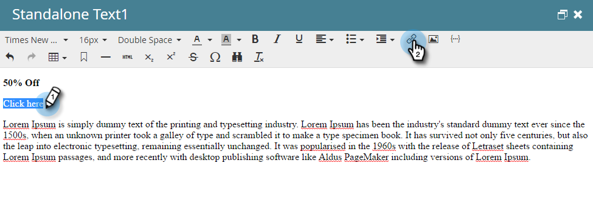
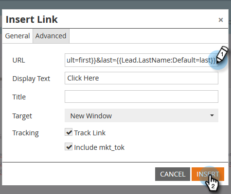
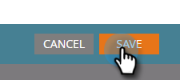

# Add Tokens to an Email Link {#add-tokens-to-an-email-link}

To insert extra and person-specific parameters into your links, you can use tokens. Here's how.

1. Select your email and click the **[!UICONTROL Edit Draft]** tab.

   

1. Double-click an editable area.

   

1. Locate or write the text for the link. Highlight it, and click the **[!UICONTROL Insert/Edit Link]** icon.

   

1. Type the desired token(s) in **[!UICONTROL URL]** and click **[!UICONTROL Insert]**.

   

1. Click **[!UICONTROL Save]**.

   

   And that's it!

>[!MORELIKETHIS]
>
>[Using URLs in My Tokens](/help/marketo/product-docs/email-marketing/general/using-tokens/using-urls-in-my-tokens.md)
