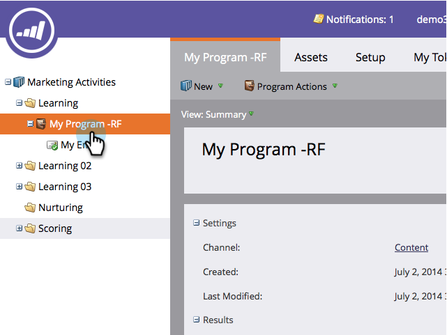
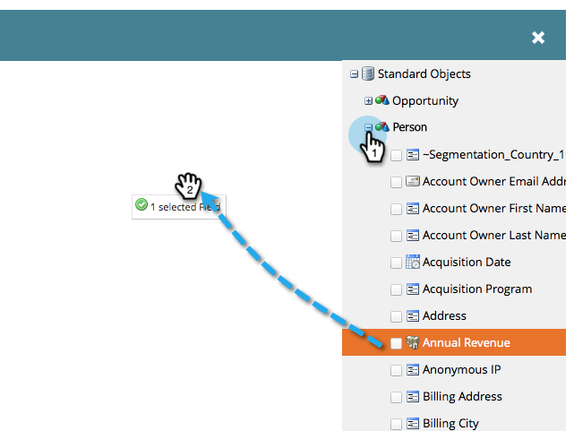
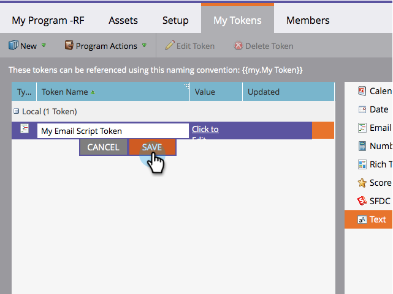

# Create an Email Script Token {#create-an-email-script-token}

For advanced developers, you can use  [Velocity scripts](http://velocity.apache.org/engine/1.7/user-guide.html) in your emails. Here's how to do it.

1. Go to **Marketing Activities**.

   

1. Find and select any program (Event, Default, or Engagement, etc).

   

1. Under the **My Tokens** tab, drag in an **Email Script** token.

   

1. Name your email script token and **click to edit** its content.

   

1. Use the tree on the right to drag in **Person, Opportunity**, or **Custom Object** tokens.

   

   >[!NOTE]
   >
   >When accessing an array (opportunity or custom object) you are limited to the most recent 10 items associated to the person.

1. Notice the token becomes checked/active after you drag it into the script editor.

   

   >[!NOTE]
   >
   >**Reminder**
   >
   >
   >If you are typing in tokens free-form ensure to check/activate all corresponding tokens in the tree or they will be treated as plain text and won't work.

1. Write your script in Velocity. Here are some useful resources:

    * [Marketo Developers Email Scripting Documentation](http://developers.marketo.com/email-scripting/)
    * [Velocity User Guide](http://velocity.apache.org/engine/devel/user-guide.html)
    * [Velocity Reference Guide](http://velocity.apache.org/engine/devel/vtl-reference-guide.html)
    * [Velocity Tools Javadoc](http://velocity.apache.org/tools/releases/2.0/javadoc/index.html)

1. Once your script is completed, click **Save**.

   

1. Click **Save** one more time.

   

Now you can use this token in your emails. It will run the script every time an email is sent.

>[!MORELIKETHIS]
>
>* [Add an Email Script Token to Your Email](add-an-email-script-token-to-your-email.md)
>

