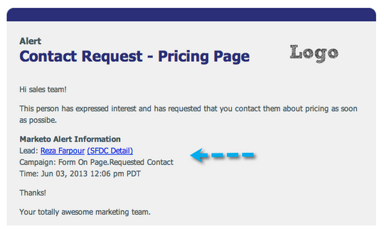
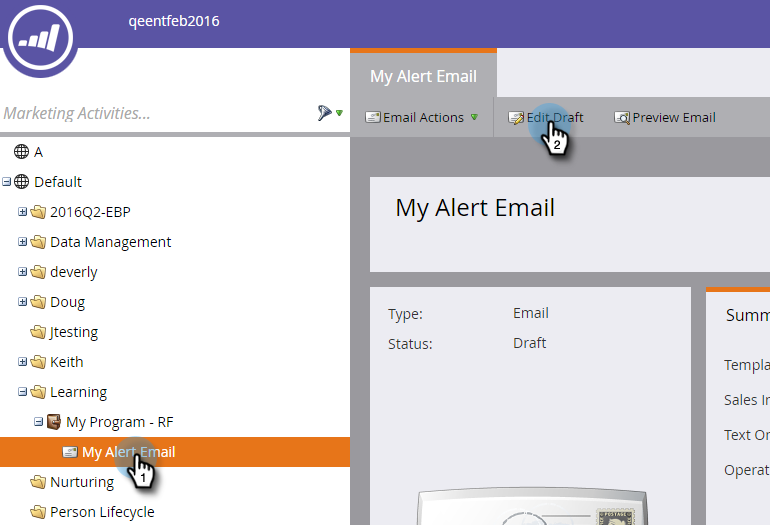
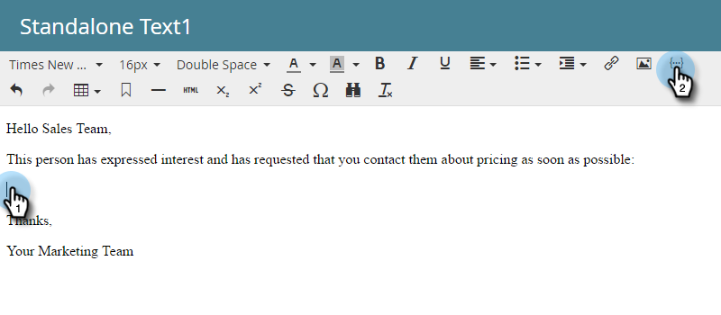
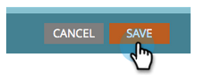

# Use the Send Alert Info Token {{SP_Send_Alert_Info}} {#use-the-send-alert-info-token-sp-send-alert-info}

The {{SP_Send_Alert_Info}} token is a special token to be used when creating alert emails for your sales team.

>[!NOTE]
>
>**FYI**
>
>Marketo is now standardizing language across all subscriptions, so you may see lead/leads in your subscription and person/people in docs.marketo.com. These terms mean the same thing; it does not affect article instructions. There are some other changes, too. [Learn more](http://docs.marketo.com/display/DOCS/Updates+to+Marketo+Terminology).

>[!TIP]
>
>This token only works as intended when sending the email containing it with the [Send Alert](../../../../product-docs/core-marketo-concepts/smart-campaigns/flow-actions/send-alert.md) flow step. It will not work when used in a Send Email flow step.

Example alert:   

>[!NOTE]
>
>Heads up! URLs in alerts have expiration dates so make sure they have a cadence that supports these types of messages. Expiration dates are [configured by an Admin](../../../../product-docs/administration/settings/edit-link-expiration-in-reports-and-alerts.md).

The following information is included as part of the {{SP_Send_Alert_Info}}:

* First name and last name as a link to the person detail in Marketo
* A link to the person in your CRM
* The campaign name in Marketo that sent the alert
* The time at which the alert was sent

>[!NOTE]
>
>The link to the CRM will only appear if the person is in the CRM system (currently not available with Dynamics CRM). The link is accessible to both Marketo and non-Marketo users.

#### Add the {{SP_Send_Alert_Info}} Token to an Email {#add-the-sp-send-alert-info-token-to-an-email}

1. Select the email and click **Edit Draft**.

   

1. Double-click the editable area you want to add the token to.

   

1. Place the cursor where you want the token to be, then click the **Insert Token** button.

   

1. Find and select the **{{SP_Send_Alert_Info}}** token and click **Insert**.

   

1. Click **Save**.

   

>[!NOTE]
>
>**Reminder**
>
>Don't forget to approve your email.

Good stuff! This token is very useful and you should use it in all alerts you create for your sales team. 