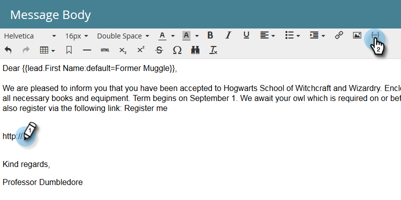
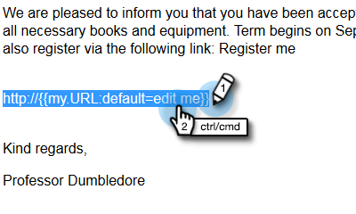
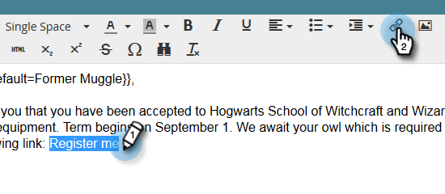
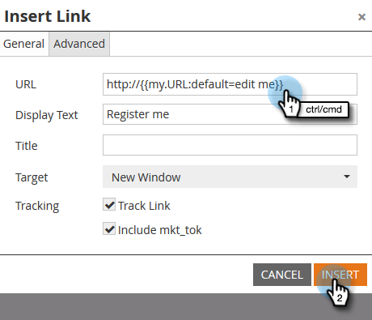
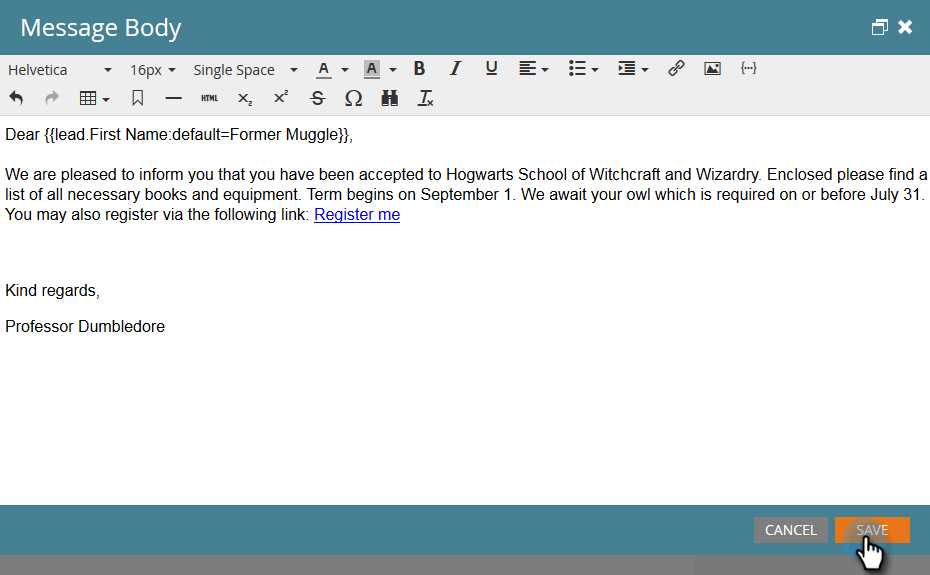

# Using URLs in My Tokens {#using-urls-in-my-tokens}

Follow the steps below to use [!UICONTROL My Tokens] to insert URLs into your emails.

1. Select your program and click **[!UICONTROL My Tokens]**.

   

1. Select the **[!UICONTROL Text]** My Token, drag and drop it onto the canvas.

   

1. Give the token a unique name, enter a URL (without the https://) and click **[!UICONTROL Save]**.

   

   >[!CAUTION]
   >
   >**Using http/https...**
   >
   >* To make sure clicks are tracked in your email, do **not** enter https:// _inside_ the token's value. Use it outside of the token, as shown in Step 7.
   >
   >* We highly recommend not leaving out the http/https. Doing so could cause the [web version](/help/marketo/product-docs/email-marketing/general/functions-in-the-editor/add-a-view-as-web-page-link-to-an-email.md){target="_blank"} of your email to render incorrectly.

1. Select the email in your program.

   

1. Click **[!UICONTROL Edit Draft]**.

   

1. Double-click in the text area to edit.

   

1. Anywhere in your email, type `https://` (without leaving a space after) and click the Insert Token icon.

   

   >[!NOTE]
   >
   >You of course also have the option of entering `http://` if your site doesn't use https.

1. Locate your My Token, select it, and click **[!UICONTROL Insert]**.

   

1. Highlight the https:// and token, then press Ctrl/Cmd+X (Ctrl = Windows/Cmd = Mac) to cut the text.

   

1. Highlight the text you want the link to display and click the [!UICONTROL Insert/Edit Link] icon.

   

1. Press Ctrl/Cmd+V to paste the content into the **[!UICONTROL URL]** box and click **[!UICONTROL Insert]**.

   

1. Click **[!UICONTROL Save]**.

   

   And you're done! Your URL will populate after sending, and thanks to you putting https:// in front of the token, it will produce a trackable link.
