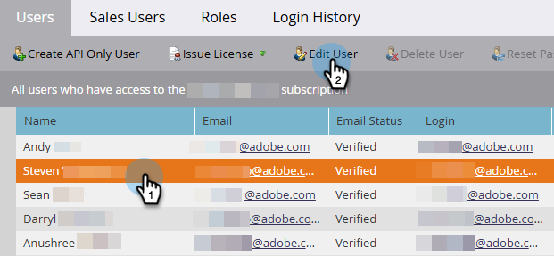

# Settings and setup {#settings-setup}

Learn how to enable permissions and use the Settings area to view connection details, define organizational rules, and set up integrations and notifications.

## Permissions and roles {#permission-and-role}

There is an _Access Build with AI_ permission and a _Build with AI User_ role, giving administrators greater control over which users can access the **Build with AI** feature. The permission is assigned at the role level. The _Build with AI User_ role comes with the _Access Build with AI_ permission enabled by default.

>[!IMPORTANT]
>
>The _Access Build with AI_ permission is not enabled by default for all roles. See the table below for details.

| Role | Default status |
| --- | --- |
| Admin | Enabled |
| Adobe Product Admin | Enabled |
| Marketing User | Disabled |
| Standard User | Not available |
| Build with AI User | Enabled |
| Custom roles | Disabled |

### Access Build with AI permission {#access-build-with-ai-permission}

Follow the steps below to enable _Access Build with AI_ for qualifying roles that don't already have it enabled.

1. In your My Marketo, click **Admin**, then **Users & Roles**.

   

1. In the _Roles_ tab, select the desired role and click **Edit Role**.

   

1. Scroll down and check the _Access Build with AI_ checkbox and click **Save**.

   

   >[!NOTE]
   >
   >You can use these same steps to remove the permission by **un**checking the _Access Build with AI_ checkbox.

### Build with AI User role {#build-with-ai-user-role}

Follows these steps to assign a specific user to the _Build with AI User_ role.

>[!NOTE]
>
>This role **only** contains the _Access Build with AI_ permission.

1. In your My Marketo, click **Admin**, then **Users & Roles**.

   

1. Select the desired user and click **Edit User**.

   

1. In _Roles and Workspaces_, select the _Build with AI User_ checkbox. If you have more than one workspace, you can specify which ones get access in the **+** sign drop-down. Click **Save** when done.

   

### Custom role {#custom-role}

You also have the option to [create a new role](https://experienceleague.adobe.com/en/docs/marketo/using/product-docs/administration/users-and-roles/create-delete-edit-and-change-a-user-role#create-a-role){target="_blank"} and customize its permissions, adding _Access Build with AI_, along with anything else you want, and [assigning that role](https://experienceleague.adobe.com/en/docs/marketo/using/product-docs/administration/users-and-roles/managing-user-roles-and-permissions#assign-roles-to-a-user){target="_blank"} to specific users.

## Settings {#settings}

1. In your My Marketo, click the **Build with AI** tile.

   

1. Click the gear icon.

   

### Connection {#connection}

This tab is does not contain editable fields. It shows you account information like your Munchkin ID and IMS Organization.

   

### Organizational rules {#organizational-rules}

Define organizational guidelines and constraints that the Marketo AI follows when creating or modifying Marketo Engage assets.

   {width="800" zoomable="yes"}

>[!NOTE]
>
>Rules use Markdown format with YAML frontmatter. Global rules apply to all workspaces. Workspace rules override global settings.

### Integrations (Coming soon) {#integrations}

Configure connections to external services and APIs.

_This tab may appear in the UI, but it is not yet available for use. Please check back for updates_.

### Notifications (Coming soon) {#notifications}

Manage alert preferences and notification channels.

_This tab may appear in the UI, but it is not yet available for use. Please check back for updates_.
