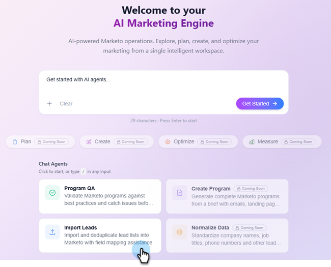

# Import leads {#import-leads}

Import and deduplicate lead lists into your Marketo Engage database with field mapping assistance.

>[!AVAILABILITY]
>
>This feature is currently in open beta. To request access, contact your account manager. You must also agree to the [Core Gen-AI terms and the supplemental terms](https://www.adobe.com/legal/terms/enterprise-licensing/genai-ww.html){target="_blank"}.

## How to use {#how-to-use}

1. In your My Marketo, click the **Marketo AI** tile.

   

1. Click the **Import Leads** agent.

   

   You are taken to the conversational AI screen. The left pane displays guidance, responses, and available data normalization options.

   

1. To start importing your leads, click the attachment icon and upload them via .CSV file.

   

1. Type "Import list" and click **Send**.

   

   Your list is previewed in the center console.

   

1. Enter a desired business rule and click **Send**.

   

   The results appear in the center console.

   

   If desired, enter additional business rules.

1. To view the mapped fields, click the **Mappings** tab.

1. If any fields were mapped incorrectly, fix them here.

   

1. When ready to import your list, click the **Import to Marketo** tab.

1. Select the destination folder and enter a name. Check each consent box and click **Approve & Import to Marketo**.

   

When the import is done, a verification summary appears showing leads processed, rows failed, and any warnings.

