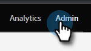
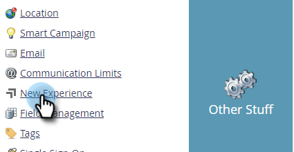

# Toggle Switch {#toggle-switch}

The Toggle Switch allows you to switch between Marketo's classic interface and the Modern UX. It's available in all of the areas highlighted below.

>[!NOTE]
>
>When the Toggle Switch is selected, all existing workflows will be autosaved prior to the UI change occurring. If an operation is already in progress (ex: an asset is in the process of being approved), you'll receive an error message indicating as such and should try again after the operation is completed.

## Enable the Toggle Switch for Individual Roles {#enable-the-toggle-switch-for-individual-roles}

Enable the toggle switch for individual roles or all roles. Here's how.

1. In Marketo Engage, click **Admin**.

   

1. Click **New Experience**.

   

1. Select the role(s) you want to have access to the toggle switch.

   

## Enable for Features {#enable-for-features}

You have the option of manually enabling the Marketo Engage Modern UX for indivudual features, or all available features (current and forthcoming).

In an area that currently has the Toggle Switch (in this example we're in Email List View), simply click the toggle on the bottom-right of the page.

   

The new experience will load.

   

To enable it for _all_ features, click the gear icon next to the toggle switch.

   

Select **Enable for all available features** and click **OK**.

   

## Available Features {#available-features}

The following features are currently available in the Modern UX (with new features added each release):

* Email Details View
* Email List View
* Email Template Details View
* Email Template List
* Email Test Dashboard View
* Form Details View
* Form List View
* Images and Files Details Page
* Landing Page Details View
* Landing Page List View
* Landing Page Template Details
* Landing Page Template List
* Snippet Details View
* Snippet List View

