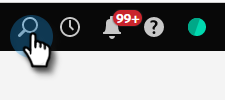

# Using the Global Search {#using-the-global-search}

The powerful global search gives you plenty of options with no limit on displayed results.

## Performing a Search {#performing-a-search}

1. In the Global Nav, click the search icon.

   

1. Type in identifying text for your asset.

   

1. Search results appear. You can click anywhere in any of the breadcrumbs to be taken directly to that item.

   

1. In this example, we're choosing to be taken directly to the email we're looking for. Click the email's name.

   

You're taken directly to the desired email.

   

## Search Results Page {#search-results-page}

   

<table> 
 <tbody>
  <tr>
   <td>1</td> 
   <td>Name of the item/destination</td> 
  </tr>
  <tr>
   <td>2</td> 
   <td>Path (breadcrumbs) to the respective item/destination</td> 
  </tr>
  <tr>
   <td>3</td> 
   <td>Date and time the item/destination was last modified</td> 
  </tr>
  <tr>
   <td>4</td> 
   <td>Date and time the item/destination was created</td> 
  </tr>
  <tr>
   <td>5</td> 
   <td>Implement focused filters to narrow search results</td> 
  </tr>
 </tbody>
</table>

**OPTIONAL STEP**: To utilize filtering, simply select your desired options.

  
